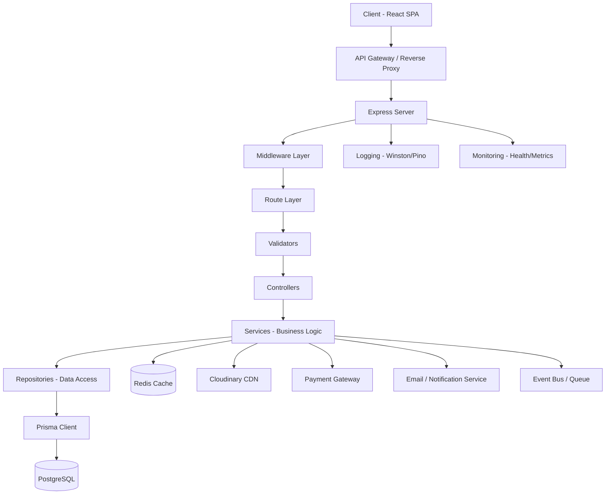
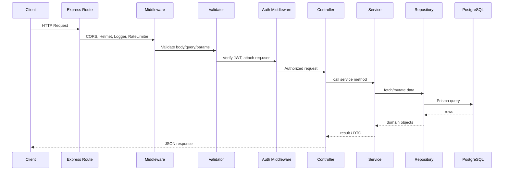
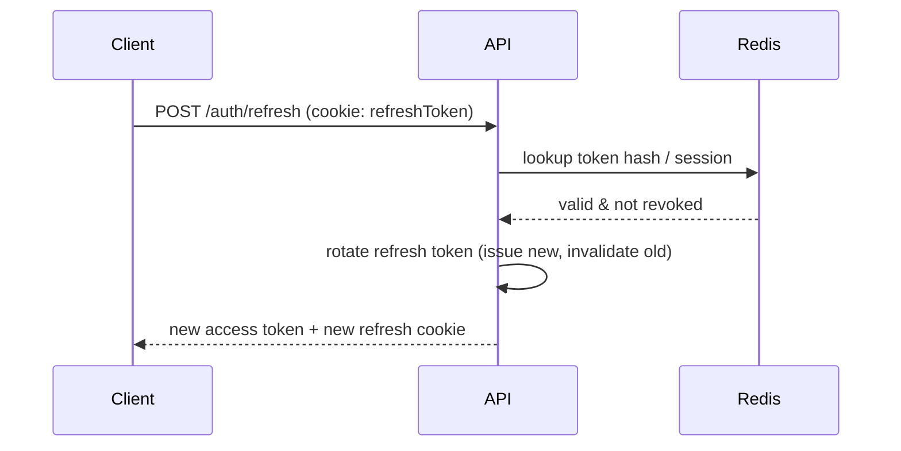
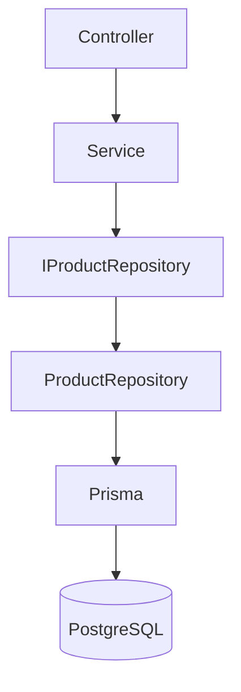
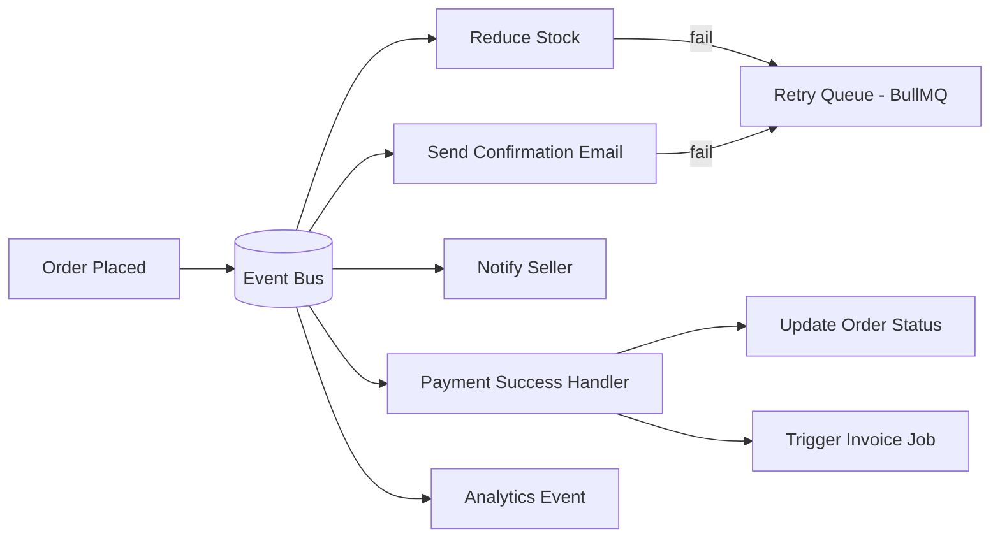
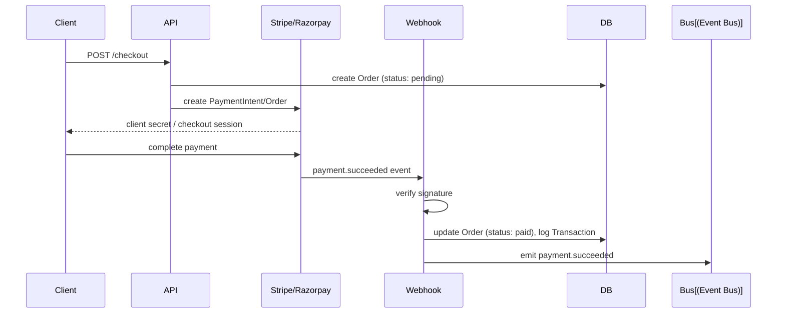
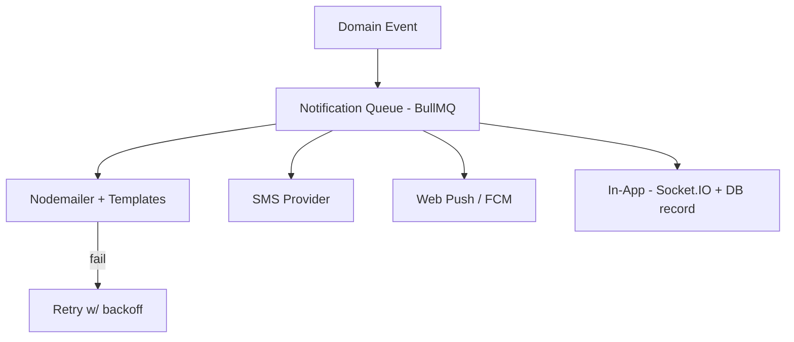
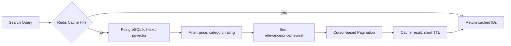
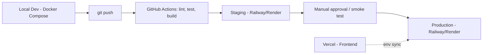
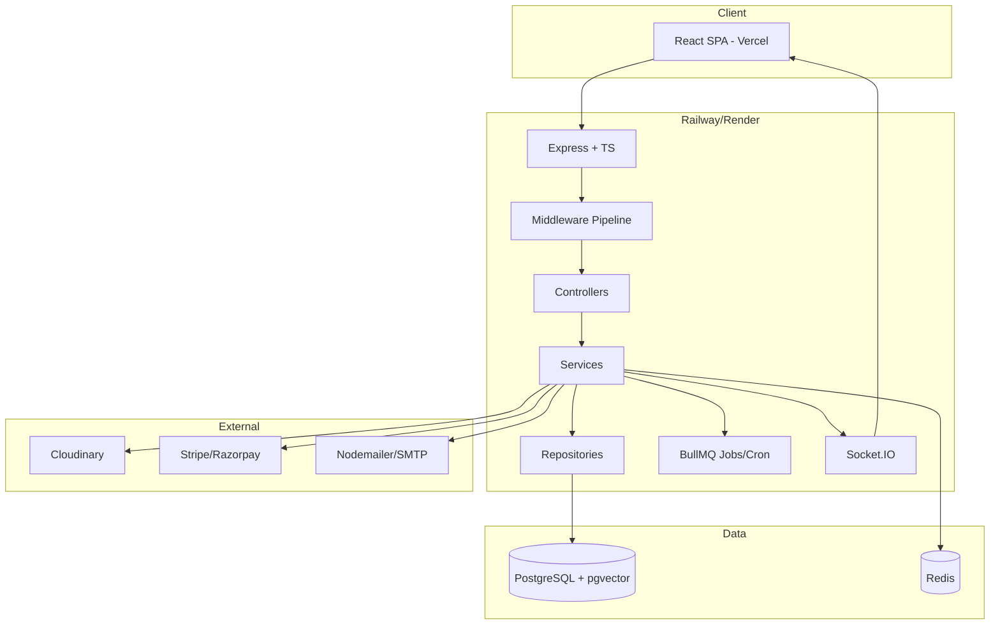

# Phase 5 — Backend Architecture
### AI-Powered Smart Commerce Platform

Stack: Node.js · Express.js · TypeScript · PostgreSQL · Prisma · Redis · JWT · Cloudinary · Razorpay/Stripe · Nodemailer · Docker · Vercel (frontend) · Railway/Render (backend)

---

## 1. Backend High-Level Architecture

The backend follows a **layered / clean architecture**: each layer only talks to the layer directly beneath it, so business logic never touches HTTP or SQL directly. This makes the codebase testable, swappable (e.g. Prisma → another ORM) and easy to reason about as the team grows.



**Layer responsibilities**

| Layer | Responsibility |
|---|---|
| API Gateway | TLS termination, routing, rate limiting at the edge (Railway/Render proxy or Nginx) |
| Express Server | Bootstraps app, mounts middleware/routes, central error handler |
| Middleware | Cross-cutting concerns: auth, CORS, security headers, logging |
| Controllers | Parse `req`, call one service method, shape `res` — no business logic |
| Services | All business rules, orchestration across repositories/external APIs |
| Repositories | Only place that talks to Prisma — isolates persistence details |
| Prisma | Type-safe query builder / ORM over PostgreSQL |
| Redis | Cache, sessions, rate limiting, queues |
| Cloudinary | Media storage + CDN delivery |
| Payment Gateway | Stripe/Razorpay for checkout, webhooks |
| Logging/Monitoring | Observability across all layers |

---

## 2. Folder Responsibility

```
src/
├── config/          # env loading, db/redis/cloudinary clients, constants
├── routes/          # express.Router() definitions, versioned (v1)
├── controllers/     # req/res handlers, no business logic
├── services/        # business logic, orchestration
├── repositories/     # Prisma queries only, implements repo interfaces
├── middlewares/      # auth, error, rate-limit, upload, logging
├── validators/        # Zod/Joi schemas per route
├── utils/            # pure helper functions (jwt sign, hashing, slugify)
├── types/            # shared TS types (DTOs, enums)
├── interfaces/        # repository/service contracts (DIP)
├── jobs/              # cron + queue processors (BullMQ)
├── events/            # event emitter, event handlers (order.placed, etc.)
├── socket/            # Socket.IO gateway for real-time notifications
├── docs/              # OpenAPI/Swagger spec
├── uploads/           # temp local storage before Cloudinary push
├── logs/              # rotated log files (dev only; prod ships to stdout)
prisma/
├── schema.prisma
├── migrations/
tests/
├── unit/, integration/, e2e/
```

| Folder | Why it exists |
|---|---|
| `config/` | Single source of truth for env vars and third-party client instances (Prisma, Redis, Cloudinary) — nothing else instantiates these directly |
| `routes/` | Maps HTTP verb+path → controller, attaches per-route middleware/validators |
| `controllers/` | Thin adapters between HTTP and services; never import Prisma |
| `services/` | Where "what happens when an order is placed" actually lives |
| `repositories/` | Swappable data layer; services depend on interfaces, not Prisma directly |
| `middlewares/` | Reusable, composable request-pipeline steps |
| `validators/` | Fail fast before any business logic runs |
| `jobs/` | Anything time-based or async-heavy (emails, cleanup, reminders) |
| `events/` | Decouples side effects (e.g., "send email" doesn't block "place order") |
| `socket/` | Live order status, admin dashboard pushes |

---

## 3. Request Flow



Every request that fails at any stage (validation, auth, service exception) is funneled to a single centralized **error-handling middleware** at the end of the stack — controllers never write their own `try/catch` error responses, they just `next(err)`.

---

## 4. Authentication Flow

**Signup**
1. Validate input → check email uniqueness → hash password (bcrypt, 12 rounds) → create user (status: `unverified`) → generate email-verification token (short-lived JWT or random token stored in Redis) → send verification email.

**Email Verification**
2. User clicks link → token validated → `user.isVerified = true` → optional auto-login.

**Login**
3. Validate credentials → compare bcrypt hash → issue **Access Token** (JWT, 15 min, signed with `ACCESS_SECRET`) + **Refresh Token** (JWT or opaque random string, 7–30 days, signed with `REFRESH_SECRET`).
4. Refresh token stored **hashed** in DB (or Redis) with device/user-agent metadata for session tracking and revocation; sent to client as an `httpOnly`, `Secure`, `SameSite=Strict` cookie. Access token returned in response body (kept in memory on the client, never localStorage, to reduce XSS exposure).

**Refresh Flow**



Refresh token **rotation** is used: every refresh call invalidates the old token and issues a new one. If an already-used (revoked) refresh token is replayed, all sessions for that user are force-logged-out — this detects token theft.

**Logout** — deletes the session record from Redis/DB and clears the cookie.

**Password Reset** — user requests reset → one-time token (15 min TTL) emailed → token validated → new password hashed and saved → all existing refresh sessions revoked.

**Role-Based Authorization** — JWT payload carries `{ userId, role }` (`CUSTOMER`, `SELLER`, `ADMIN`). An `authorize(...roles)` middleware runs after `authenticate` and checks `req.user.role`.

**Session Management** — each refresh token = one session row (`userId`, `deviceInfo`, `ip`, `createdAt`, `expiresAt`, `revoked`), enabling "log out of all devices."

**Security practices**: short-lived access tokens, rotated refresh tokens, `httpOnly` cookies, bcrypt with per-user salt, rate-limited auth endpoints, generic error messages (never reveal "email not found" vs "wrong password"), account lockout after N failed attempts.

---

## 5. Middleware Architecture

Execution order (top to bottom) for a typical protected write route:


| Middleware | Purpose |
|---|---|
| Helmet | Sets secure HTTP headers (CSP, HSTS, X-Frame-Options) |
| CORS | Restricts allowed origins to the deployed frontend |
| Compression | gzip/brotli response bodies |
| Request Logger | Logs method, path, ip, correlation ID |
| Cookie Parser | Parses refresh-token cookie |
| Rate Limiter | Redis-backed, per-IP/per-user limits (stricter on `/auth/*`) |
| Validator | Zod schema per route; 400 on failure, blocks everything downstream |
| Authenticate | Verifies access token, attaches `req.user` |
| Authorize | Role check for protected admin/seller routes |
| Upload | Multer → memory buffer → streamed to Cloudinary |
| Error Handler | Last in stack; maps error types → status codes → JSON shape |
| Performance Logger | Wraps handler, logs response time; feeds metrics |

---

## 6. Service Layer Architecture

Each service owns one bounded context and is the **only** place business rules live.

- **UserService** — profile CRUD, address book, preference management
- **ProductService** — CRUD, variants, category assignment, AI embedding generation on create/update
- **CartService** — add/remove/merge guest cart on login, price recalculation
- **WishlistService** — add/remove, move-to-cart
- **OrderService** — checkout orchestration, stock reservation, coordinates Payment/Inventory/Notification services
- **PaymentService** — creates payment intents, verifies signatures, handles refunds
- **InventoryService** — stock decrement/rollback, low-stock alerts
- **CouponService** — validation rules, usage limits, expiry
- **ReviewService** — rating aggregation, moderation flags
- **NotificationService** — fan-out to email/SMS/push/in-app
- **AdminService** — dashboards, reporting, moderation actions
- **RecommendationService** (AI) — embedding similarity queries via pgvector, "you may also like"

Services never import each other's repositories — if `OrderService` needs inventory, it calls `InventoryService`, not `InventoryRepository` directly. This keeps ownership boundaries clean.

---

## 7. Repository Pattern

**Why**: Prisma is powerful, but letting every service call `prisma.product.findMany()` directly scatters query logic everywhere, makes testing require a real DB, and couples business logic to the ORM. The Repository Pattern puts one interface between services and Prisma.



```typescript
// interfaces/product.repository.interface.ts
export interface IProductRepository {
  findById(id: string): Promise<Product | null>;
  findMany(filter: ProductFilter): Promise<Product[]>;
  create(data: CreateProductDTO): Promise<Product>;
  update(id: string, data: UpdateProductDTO): Promise<Product>;
  delete(id: string): Promise<void>;
}

// repositories/product.repository.ts
export class ProductRepository implements IProductRepository {
  constructor(private prisma: PrismaClient) {}

  async findById(id: string) {
    return this.prisma.product.findUnique({ where: { id }, include: { images: true, category: true } });
  }
  // ...
}
```

Services receive repositories via constructor injection (simple manual DI, or a lightweight container like `tsyringe`), so unit tests can pass a mock repository with zero DB involved.

---

## 8. Event-Driven Architecture

Side effects that shouldn't block the main response (emails, stock sync, analytics) are decoupled via an internal event emitter (Node `EventEmitter`, or Redis Pub/Sub for multi-instance deployments) plus a durable queue (BullMQ on Redis) for anything that must survive a crash/restart.



Key events: `order.placed`, `payment.succeeded`, `payment.failed`, `stock.reduced`, `stock.low`, `review.created`, `coupon.expired`. Each handler is idempotent (checked via an `eventId`/order state guard) so retries never double-charge or double-decrement stock.

---

## 9. Redis Architecture

| Use case | Pattern |
|---|---|
| Caching | `product:{id}`, `category:{slug}` — TTL 5–15 min, cache-aside |
| Session | Refresh-token sessions, `session:{userId}:{deviceId}` |
| OTP | `otp:{phone/email}` — TTL 5 min, single-use, delete on verify |
| Rate Limiting | Sliding-window counters, `ratelimit:{ip}:{route}` |
| Cart | Guest cart stored fully in Redis (`cart:{sessionId}`), merged into DB cart on login |
| Recently Viewed | Redis List, capped at 20, per user |
| Product Cache | Hot product pages cached to absorb read spikes |
| Search Cache | Cache query+filter hash → result IDs, short TTL |

**Invalidation strategy**: write-through on mutation (update product → delete `product:{id}` key immediately) plus TTL as a safety net for anything missed. Category/listing caches are invalidated by pattern (`SCAN` + `DEL category:*`) rather than tracked individually.

---

## 10. File Upload Architecture


- **Validation**: MIME-type whitelist (`image/jpeg`, `image/png`, `image/webp`), max size (e.g. 5 MB), max file count per product gallery (e.g. 8).
- **Compression**: `sharp` resizes/re-encodes before upload to cut bandwidth and Cloudinary storage cost.
- **Product Gallery**: multiple images per product, one marked primary; Cloudinary folder per product ID.
- **Avatar**: single image, square crop transformation applied via Cloudinary URL params.
- **Storage/CDN**: Cloudinary handles storage, on-the-fly transformations (`w_400,q_auto,f_auto`), and global CDN delivery — origin servers never serve raw images.

---

## 11. Payment Architecture



- **Stripe** for international cards, **Razorpay** for domestic (UPI/cards/netbanking) — a `PaymentProvider` interface abstracts both behind one `PaymentService`.
- **Webhook** endpoints are raw-body verified using each provider's signature header; never trust client-reported payment status alone.
- **Refunds**: `PaymentService.refund(orderId)` calls the provider's refund API, updates `Transaction` and `Order` status.
- **Failure Recovery / Retry**: failed webhook processing goes to a BullMQ retry queue with exponential backoff; unresolved after N attempts → alert + manual review.
- **Transaction Logging**: every gateway interaction (intent created, succeeded, failed, refunded) written to an immutable `Transaction` table for audit and reconciliation.
- **Payment Verification**: order is only marked `paid` after webhook confirmation — not on the client-side redirect — to prevent spoofed "success" states.

---

## 12. Notification Architecture



- All channels are queued (never sent synchronously in the request path).
- **Templates**: Handlebars/MJML templates per event type (order confirmation, shipping update, password reset) rendered server-side.
- **In-App**: written to a `Notification` table and pushed live via Socket.IO if the user is connected.
- **Retry**: 3 attempts with exponential backoff, then dead-letter for manual inspection.

---

## 13. Search Architecture



- **Search API**: PostgreSQL full-text search (`tsvector`) for keyword matching combined with pgvector cosine-similarity for semantic/AI search ("comfortable running shoes" → relevant matches beyond exact keywords).
- **Filtering**: price range, category, brand, rating, in-stock — composed as dynamic Prisma `where` clauses.
- **Sorting**: relevance (default), price asc/desc, newest, best-selling.
- **Pagination**: cursor-based (not offset) for stable results under concurrent writes.
- **Recommendations/Trending**: precomputed nightly job scores products by views/purchases; "similar products" uses embedding similarity, cached per product.

---

## 14. Error Handling Architecture

A single `AppError` base class with subclasses (`ValidationError`, `AuthError`, `NotFoundError`, `PaymentError`, `ExternalServiceError`) carries `statusCode` and `isOperational`. The centralized error middleware:

- **Operational errors** (expected — bad input, not found, expired token) → clean JSON response with the correct status code.
- **Programmer errors** (unexpected exceptions, DB connection loss) → logged with full stack trace, generic 500 returned to client, alert fired.
- **Database errors** → Prisma error codes (`P2002` unique constraint, `P2025` not found) mapped to friendly messages.
- **Payment/Cloudinary/External API errors** → wrapped as `ExternalServiceError`, triggers retry queue where applicable.
- **Retry strategy**: idempotent operations get automatic retry (webhooks, emails); non-idempotent ones (charge a card) never auto-retry blindly — they check state first.

---

## 15. Logging Architecture

- **Winston** (or Pino for higher throughput) with structured JSON logs, correlation ID per request (propagated through services).
- **Request logs**: method, path, status, latency, user ID.
- **Error logs**: stack trace, request context, severity.
- **Audit logs**: admin actions (product deleted, role changed, refund issued) — who/what/when, immutable.
- **Security logs**: failed logins, rate-limit hits, token reuse detection.
- **Performance logs**: slow query/handler warnings (>500ms).
- **Log rotation**: daily rotation + compression locally in dev; in production, logs stream to stdout and are collected by the hosting platform (Railway/Render) or shipped to a log aggregator (e.g. Better Stack, Datadog).

---

## 16. Security Architecture

- **Helmet** for secure headers, strict CSP.
- **JWT** short-lived access + rotated refresh tokens, separate signing secrets.
- **CSRF**: mitigated via `SameSite=Strict` cookies + custom header check on state-changing requests (since JWT isn't cookie-auto-sent for API calls except the refresh cookie).
- **XSS**: output encoding on any user-generated content (reviews, product descriptions), CSP disallowing inline scripts.
- **SQL Injection**: Prisma parameterizes all queries by default — raw queries are avoided or strictly parameterized.
- **Rate Limiting**: Redis sliding-window, tighter limits on auth/payment routes.
- **Password Hashing**: bcrypt, cost factor 12.
- **Encryption**: TLS in transit everywhere; sensitive fields (if any) encrypted at rest.
- **Secrets/Env Vars**: never committed; managed via Railway/Render/Vercel secret stores, validated at boot with a schema (e.g. `envalid`/Zod) so missing secrets crash startup, not runtime.
- **Input Validation**: Zod schemas on every route, whitelisting not blacklisting.

---

## 17. Background Jobs

Managed with **BullMQ** (Redis-backed queues) + **node-cron** for schedules.

| Job | Trigger |
|---|---|
| Email Queue Processor | continuous, consumes notification queue |
| Inventory Sync | on `stock.reduced` events + nightly reconciliation |
| Coupon Expiry Sweep | hourly cron — deactivates expired coupons |
| Order Cleanup | daily — cancels unpaid orders older than 24h, restocks reserved inventory |
| Abandoned Cart Reminder | every 6h — emails users with items sitting in cart >24h |
| Scheduled Notifications | flash-sale start/end alerts |

---

## 18. Monitoring Architecture

- **Health Check**: `/health` endpoint checks DB, Redis, and returns 200/503 — used by Railway/Render for auto-restart.
- **Metrics**: request rate, error rate, p50/p95/p99 latency (exposed via `prom-client` if using Prometheus, or platform-native metrics).
- **CPU/Memory**: platform dashboard (Railway/Render built-in).
- **Database**: connection pool utilization, slow query log.
- **Redis**: memory usage, eviction rate, hit/miss ratio.
- **Cloudinary**: upload failure rate.
- **Payments**: webhook failure rate, payment success rate by provider.
- **Alerts**: threshold-based alerts (error rate spike, health check failing) via email/Slack webhook.

---

## 19. Deployment Architecture



- **Development**: `docker-compose.yml` spins up Postgres + Redis + API locally, hot-reload via `ts-node-dev`/`nodemon`.
- **Staging**: mirrors production config, seeded with anonymized data, used for QA and payment sandbox testing.
- **Production**: Railway or Render deploys the same Docker image built by CI; environment variables set per environment, never shared.
- **Docker**: multi-stage `Dockerfile` (build stage compiles TS → JS, runtime stage is a slim `node:alpine` image running only compiled output).
- **CI/CD (GitHub Actions)**: on PR → lint + typecheck + unit tests; on merge to `main` → build image, run integration tests, deploy to staging automatically, production deploy gated behind manual approval.

---

## 20. Scalability Plan

- **Horizontal Scaling**: stateless Express instances (sessions in Redis, not memory) so Railway/Render can run multiple replicas behind their load balancer.
- **Load Balancer**: platform-provided; sticky sessions unnecessary since state lives in Redis.
- **Caching**: aggressive read-through caching for product/category pages absorbs most read load.
- **CDN**: Cloudinary + Vercel edge network handle all static/media delivery, keeping origin load down.
- **Database Optimization**: proper indexing (foreign keys, search columns, composite indexes for common filters), connection pooling (PgBouncer if needed).
- **Read Replicas**: introduce a PostgreSQL read replica for heavy read paths (search, listings) once write load justifies it; Prisma reads route to replica, writes to primary.
- **Queue**: BullMQ absorbs bursty async work so API response times stay flat under load.
- **Microservices Migration Strategy**: start modular-monolith (current design) with clear service boundaries; if a bounded context (e.g. Search, Notifications, Payments) outgrows the monolith, it can be extracted into its own deployable service since it already has a clean interface and doesn't share repositories with others.

---

## 21. Backend Best Practices

- **Clean Architecture**: dependency direction always points inward (Controller → Service → Repository → Prisma); inner layers never import outer layers.
- **SOLID Principles**: single-responsibility services, repository interfaces (DIP), open/closed via strategy pattern for payment providers.
- **Dependency Injection**: constructor injection for repositories/services, enabling isolated unit tests.
- **Testing Strategy**: unit tests for services (mocked repositories), integration tests for repositories (test DB via Docker), e2e tests for critical flows (signup→login, checkout→payment) via Supertest.
- **Performance Optimization**: N+1 query avoidance via Prisma `include`/`select`, caching hot paths, pagination everywhere.
- **Security Best Practices**: as detailed in Section 16, applied consistently, revisited every release.

---

## 22. Summary Diagram — Full System



---

This completes Phase 5. Next natural step (Phase 6) would be the **DevOps & CI/CD pipeline spec** (Dockerfile, GitHub Actions YAML, environment matrix) or the **detailed API implementation** starting with the Auth module — let me know which you want to tackle next.