# AI-Powered Smart Commerce Platform — Database Architecture

**Stack:** PostgreSQL 16 + Prisma ORM + Redis + Node.js + Express
**Scope:** Database layer only. No backend/API code.

---

## 1. Complete ER Diagram

```mermaid
erDiagram
    USER ||--o{ ADDRESS : has
    USER ||--o| SELLER : "becomes"
    USER ||--o{ REFRESH_TOKEN : has
    USER ||--o| CART : owns
    USER ||--o{ WISHLIST : owns
    USER ||--o{ ORDER : places
    USER ||--o{ REVIEW : writes
    USER ||--o{ NOTIFICATION : receives
    USER ||--o{ SEARCH_HISTORY : generates
    USER ||--o{ USER_BEHAVIOR_EVENT : generates
    USER ||--o| USER_PREFERENCE_VECTOR : has
    USER ||--o{ AI_RECOMMENDATION : receives
    USER ||--o| NOTIFICATION_PREFERENCE : has

    SELLER ||--o{ PRODUCT : lists
    SELLER ||--o{ SELLER_DOCUMENT : submits
    SELLER ||--o{ SELLER_BANK_ACCOUNT : has
    SELLER ||--o{ WAREHOUSE : operates
    SELLER ||--o{ COUPON : creates
    SELLER ||--o{ ORDER_ITEM : fulfills

    CATEGORY ||--o{ CATEGORY : "parent of"
    CATEGORY ||--o{ PRODUCT : classifies
    BRAND ||--o{ PRODUCT : brands

    PRODUCT ||--o{ PRODUCT_VARIANT : has
    PRODUCT ||--o{ PRODUCT_IMAGE : has
    PRODUCT ||--o| PRODUCT_EMBEDDING : has
    PRODUCT ||--o{ REVIEW : receives
    PRODUCT ||--o{ WISHLIST_ITEM : "saved in"
    PRODUCT ||--o{ AI_RECOMMENDATION : "recommended as"

    PRODUCT_VARIANT ||--o{ INVENTORY : "stocked in"
    PRODUCT_VARIANT ||--o{ CART_ITEM : "added as"
    PRODUCT_VARIANT ||--o{ ORDER_ITEM : "ordered as"
    PRODUCT_VARIANT ||--o{ PRICE_HISTORY : tracks

    WAREHOUSE ||--o{ INVENTORY : stores
    INVENTORY ||--o{ INVENTORY_MOVEMENT : logs

    CART ||--o{ CART_ITEM : contains
    WISHLIST ||--o{ WISHLIST_ITEM : contains

    ORDER ||--o{ ORDER_ITEM : contains
    ORDER ||--o{ ORDER_STATUS_HISTORY : tracks
    ORDER ||--o{ PAYMENT : "paid via"
    ORDER ||--o{ SHIPMENT : "shipped via"
    ORDER ||--o{ COUPON_USAGE : redeems
    ORDER ||--o{ REFUND : "refunded via"
    ORDER ||--o{ REVIEW : "verified by"

    PAYMENT ||--o{ PAYMENT_TRANSACTION : logs
    PAYMENT ||--o{ REFUND : issues

    REVIEW ||--o{ REVIEW_IMAGE : has
    REVIEW ||--o{ REVIEW_VOTE : receives

    COUPON ||--o{ COUPON_USAGE : "used in"

    AI_RECOMMENDATION ||--o{ AI_RECOMMENDATION_FEEDBACK : tracks
    SEARCH_HISTORY ||--o{ SEARCH_CLICK_EVENT : tracks
```



*(This mermaid block renders visually in any Mermaid-compatible viewer — GitHub, Notion, VS Code, Obsidian, or mermaid.live.)*

---

## 2. Database Relationships (summary)

| Relationship | Type | Notes |
|---|---|---|
| User → Address | 1:N | A user has many saved addresses |
| User → Seller | 1:1 | A user *becomes* a seller (role upgrade, not a new identity) |
| User → Cart | 1:1 | One active cart per user (guest carts keyed by session instead) |
| User → Wishlist | 1:N | Multiple named wishlists allowed |
| User → Order | 1:N | Order history |
| Seller → Product | 1:N | A seller lists many products |
| Product → ProductVariant | 1:N | Size/color/SKU-level variants |
| ProductVariant → Inventory | 1:N | Stock per warehouse |
| Category → Category | 1:N (self) | Recursive category tree |
| Order → OrderItem | 1:N | Line items |
| OrderItem → Seller | N:1 | Marketplace orders span multiple sellers — captured per line item, not per order |
| Order → Payment | 1:N | Supports split/partial payments and retries |
| Payment → Refund | 1:N | Partial refunds supported |
| Product ↔ User (Review) | N:N (via Review, order-gated) | Verified-purchase reviews |
| Coupon ↔ User (via Order) | N:N (via CouponUsage) | Usage-limit enforcement |
| Product → ProductEmbedding | 1:1 | Vector representation for similarity search |
| User → UserPreferenceVector | 1:1 | Vector representation of taste profile |
| User/Product → AiRecommendation | N:N | Scored recommendation pairs, algorithm-tagged |

---

## 3. Normalization (3NF)

The schema is normalized to **Third Normal Form**, with deliberate, documented exceptions for performance (denormalization is called out explicitly, never accidental).

**1NF** — every column atomic: no comma-separated fields. Multi-valued data (product attributes, dimensions, event metadata) lives in `jsonb` columns *only* where the data is genuinely schema-less (e.g., variant attributes differ per category); anything queried/filtered relationally (price, quantity, status) is a real column.

**2NF** — every non-key attribute depends on the *whole* primary key. This is why composite-key tables (`cart_items`, `inventory`, `coupon_usages`) don't smuggle in attributes that only depend on part of the key — e.g., `cart_items` doesn't store `productTitle`, because title depends on `variantId`'s parent product, not on `(cartId, variantId)` jointly.

**3NF** — no transitive dependencies. Example: `order_items` stores `unitPrice` (the price *at time of purchase*) instead of joining live to `product_variants.price`. This is **not** a normalization violation — it's a historical fact (what the customer actually paid), which is a different fact from the product's *current* price. Conflating the two is a classic e-commerce bug; keeping them separate is what makes `price_history` meaningful.

**Intentional denormalization (cache columns), always derivable and always documented:**
- `products.avgRating`, `products.ratingCount` — recomputed from `reviews`, cached to avoid `AVG()` on every product page load.
- `sellers.rating` — same pattern.
- `products.totalSold` — recomputed from `order_items`, cached for sort/ranking queries.

These are refreshed via application logic or a Postgres trigger (see §28), and are safe because they're read-heavy, write-light aggregates.

---

## 4–6. Primary Keys, Foreign Keys, Composite Keys

**Primary keys:** every table uses a `UUID` (`gen_random_uuid()` / `uuid_ossp`) as PK, not an auto-increment integer.
Why: multi-seller marketplace data gets synced across services (search index, recommendation engine, payment provider webhooks) — UUIDs avoid ID collisions across environments, don't leak row counts/business volume to competitors via sequential IDs, and merge cleanly if the platform ever shards by seller or region.

**Foreign keys:** every FK is declared with an explicit `ON DELETE` policy — never left to default. Policy choice per relationship:
- `RESTRICT` for anything financial/historical (`order_items.productId`, `payments.orderId`) — you must never be able to delete a product and silently orphan order history.
- `CASCADE` for genuinely dependent child rows with no independent meaning (`cart_items` when `cart` is deleted, `review_images` when `review` is deleted).
- `SET NULL` where the parent is optional context (`orders.couponId` if a coupon is later deleted, `notifications.actorId`).

**Composite keys / composite unique constraints** (natural composite keys, not composite PKs — UUID PK stays surrogate, but a `UNIQUE(a, b)` enforces the real-world constraint):

| Table | Composite unique constraint | Business rule enforced |
|---|---|---|
| `cart_items` | `(cartId, variantId)` | Can't add the same variant twice — quantity increments instead |
| `wishlist_items` | `(wishlistId, productId, variantId)` | No duplicate saves |
| `inventory` | `(variantId, warehouseId)` | One stock row per variant per warehouse |
| `product_variants` | `(productId, sku)` | SKU unique within a product |
| `coupon_usages` | `(couponId, orderId)` | A coupon is redeemed once per order |
| `review_votes` | `(reviewId, userId)` | One helpful/unhelpful vote per user per review |
| `categories` | `(parentId, slug)` | Slug unique within its sibling level, not globally |
| `notification_preferences` | `(userId)` unique | Exactly one preference row per user |

---

## 7. Index Strategy

Indexes are grouped by *purpose*, not just "index every FK" (though every FK is indexed — Postgres does not do this automatically, unlike the PK).

**1. Foreign key indexes** — every FK column gets a B-tree index. Without this, every `ON DELETE`/`JOIN` on the child table triggers a sequential scan.

**2. Partial indexes for soft delete** — since every "live" query filters `WHERE deletedAt IS NULL`, indexes are built partial:
```sql
CREATE INDEX idx_products_active ON products (sellerId, status) WHERE "deletedAt" IS NULL;
```
This keeps the index small and keeps it out of the plan for admin/audit queries that intentionally include deleted rows.

**3. Composite indexes matching real query patterns** (leftmost-prefix rule):
- `orders (userId, status, createdAt DESC)` — "my orders, filtered by status, newest first" is the single most common storefront query.
- `order_items (orderId, sellerId)` — sellers pulling their line items out of marketplace orders.
- `product_variants (productId, sku)` — already covered by the unique constraint above (unique constraints *are* indexes).
- `inventory (warehouseId, quantity)` — reorder/low-stock dashboards.

**4. GIN indexes** for `jsonb` and full-text:
```sql
CREATE INDEX idx_products_search ON products USING GIN (to_tsvector('english', title || ' ' || description));
CREATE INDEX idx_variant_attributes ON product_variants USING GIN (attributes);
```

**5. BRIN indexes for append-only, time-ordered logs** — `activity_logs`, `user_behavior_events`, `audit_logs` are huge and insert-only, ordered by `createdAt`. BRIN indexes cost a fraction of B-tree size for this access pattern:
```sql
CREATE INDEX idx_behavior_events_time_brin ON user_behavior_events USING BRIN (created_at);
```

**6. Vector indexes (pgvector)** for AI similarity search:
```sql
CREATE INDEX idx_product_embedding_ivfflat ON product_embeddings USING ivfflat (embedding vector_cosine_ops) WITH (lists = 100);
```

**7. Unique indexes double as constraints** where noted in §4–6 — Postgres doesn't need a separate index if the unique constraint already covers the query.

---

## 8. Prisma Schema

```prisma
// ============================================================
// datasource / generator
// ============================================================
generator client {
  provider        = "prisma-client-js"
  previewFeatures = ["postgresqlExtensions"]
}

datasource db {
  provider   = "postgresql"
  url        = env("DATABASE_URL")
  extensions = [pgcrypto, vector]
}

// ============================================================
// ENUMS
// ============================================================
enum UserRole {
  CUSTOMER
  SELLER
  ADMIN
  SUPER_ADMIN
}

enum UserStatus {
  ACTIVE
  SUSPENDED
  BANNED
  PENDING_VERIFICATION
}

enum AddressType {
  SHIPPING
  BILLING
}

enum SellerStatus {
  PENDING
  APPROVED
  REJECTED
  SUSPENDED
}

enum DocumentStatus {
  PENDING
  VERIFIED
  REJECTED
}

enum ProductStatus {
  DRAFT
  ACTIVE
  INACTIVE
  BANNED
  OUT_OF_STOCK
}

enum InventoryMovementType {
  IN
  OUT
  RESERVED
  RELEASED
  ADJUSTMENT
}

enum CartStatus {
  ACTIVE
  CONVERTED
  ABANDONED
}

enum OrderStatus {
  PENDING
  CONFIRMED
  PROCESSING
  SHIPPED
  DELIVERED
  CANCELLED
  RETURNED
  REFUNDED
}

enum OrderItemStatus {
  PENDING
  CONFIRMED
  SHIPPED
  DELIVERED
  CANCELLED
  RETURNED
}

enum PaymentMethod {
  CARD
  UPI
  NETBANKING
  WALLET
  COD
}

enum PaymentStatus {
  PENDING
  AUTHORIZED
  SUCCESS
  FAILED
  REFUNDED
  PARTIALLY_REFUNDED
}

enum TransactionType {
  AUTH
  CAPTURE
  REFUND
  CHARGEBACK
}

enum RefundStatus {
  REQUESTED
  PROCESSING
  COMPLETED
  REJECTED
}

enum CouponType {
  PERCENTAGE
  FLAT
  FREE_SHIPPING
}

enum ReviewStatus {
  PENDING
  APPROVED
  REJECTED
}

enum NotificationType {
  ORDER_UPDATE
  PAYMENT
  PROMOTION
  PRICE_DROP
  BACK_IN_STOCK
  REVIEW_REQUEST
  SYSTEM
}

enum BehaviorEventType {
  VIEW
  CLICK
  ADD_TO_CART
  REMOVE_FROM_CART
  WISHLIST_ADD
  PURCHASE
  SEARCH
}

enum RecommendationFeedbackAction {
  CLICKED
  PURCHASED
  DISMISSED
  IGNORED
}

enum ActorType {
  USER
  SELLER
  ADMIN
  SYSTEM
}

enum AuditOperation {
  INSERT
  UPDATE
  DELETE
}

// ============================================================
// 16. USER TABLES
// ============================================================
model User {
  id                 String    @id @default(dbgenerated("gen_random_uuid()")) @db.Uuid
  email              String    @unique
  phone              String?   @unique
  passwordHash       String
  role               UserRole  @default(CUSTOMER)
  status             UserStatus @default(PENDING_VERIFICATION)
  isEmailVerified    Boolean   @default(false)
  isPhoneVerified    Boolean   @default(false)
  lastLoginAt        DateTime?
  createdAt          DateTime  @default(now())
  updatedAt          DateTime  @updatedAt
  deletedAt          DateTime?

  profile                UserProfile?
  addresses              Address[]
  refreshTokens          RefreshToken[]
  seller                 Seller?
  cart                   Cart?
  wishlists              Wishlist[]
  orders                 Order[]
  reviews                Review[]
  reviewVotes            ReviewVote[]
  notifications          Notification[]
  notificationPreference NotificationPreference?
  searchHistory          SearchHistory[]
  behaviorEvents         UserBehaviorEvent[]
  preferenceVector       UserPreferenceVector?
  recommendations        AiRecommendation[]
  recommendationFeedback AiRecommendationFeedback[]
  couponUsages           CouponUsage[]
  activityLogs           ActivityLog[]

  @@index([role, status])
  @@index([email])
  @@map("users")
}

model UserProfile {
  userId    String    @id @db.Uuid
  firstName String
  lastName  String
  avatarUrl String?
  dob       DateTime? @db.Date
  gender    String?
  bio       String?
  updatedAt DateTime  @updatedAt

  user User @relation(fields: [userId], references: [id], onDelete: Cascade)

  @@map("user_profiles")
}

model RefreshToken {
  id         String    @id @default(dbgenerated("gen_random_uuid()")) @db.Uuid
  userId     String    @db.Uuid
  tokenHash  String    @unique
  userAgent  String?
  ipAddress  String?
  expiresAt  DateTime
  revokedAt  DateTime?
  createdAt  DateTime  @default(now())

  user User @relation(fields: [userId], references: [id], onDelete: Cascade)

  @@index([userId])
  @@map("refresh_tokens")
}

// ============================================================
// 27. ADDRESS TABLES
// ============================================================
model Address {
  id         String      @id @default(dbgenerated("gen_random_uuid()")) @db.Uuid
  userId     String      @db.Uuid
  label      String?
  fullName   String
  phone      String
  line1      String
  line2      String?
  city       String
  state      String
  country    String
  postalCode String
  latitude   Decimal?    @db.Decimal(9, 6)
  longitude  Decimal?    @db.Decimal(9, 6)
  type       AddressType
  isDefault  Boolean     @default(false)
  createdAt  DateTime    @default(now())
  updatedAt  DateTime    @updatedAt
  deletedAt  DateTime?

  user               User    @relation(fields: [userId], references: [id], onDelete: Cascade)
  ordersAsShipping   Order[] @relation("ShippingAddress")
  ordersAsBilling    Order[] @relation("BillingAddress")

  @@index([userId])
  @@map("addresses")
}

// ============================================================
// 15. SELLER TABLES
// ============================================================
model Seller {
  id             String       @id @default(dbgenerated("gen_random_uuid()")) @db.Uuid
  userId         String       @unique @db.Uuid
  businessName   String
  businessType   String
  gstNumber      String?      @unique
  panNumber      String?      @unique
  status         SellerStatus @default(PENDING)
  commissionRate Decimal      @default(0) @db.Decimal(5, 2)
  rating         Decimal      @default(0) @db.Decimal(3, 2)
  ratingCount    Int          @default(0)
  createdAt      DateTime     @default(now())
  updatedAt      DateTime     @updatedAt
  deletedAt      DateTime?

  user          User               @relation(fields: [userId], references: [id], onDelete: Cascade)
  documents     SellerDocument[]
  bankAccounts  SellerBankAccount[]
  warehouses    Warehouse[]
  products      Product[]
  coupons       Coupon[]
  orderItems    OrderItem[]

  @@index([status])
  @@map("sellers")
}

model SellerDocument {
  id         String         @id @default(dbgenerated("gen_random_uuid()")) @db.Uuid
  sellerId   String         @db.Uuid
  docType    String
  docUrl     String
  status     DocumentStatus @default(PENDING)
  verifiedAt DateTime?
  createdAt  DateTime       @default(now())

  seller Seller @relation(fields: [sellerId], references: [id], onDelete: Cascade)

  @@index([sellerId])
  @@map("seller_documents")
}

model SellerBankAccount {
  id                  String   @id @default(dbgenerated("gen_random_uuid()")) @db.Uuid
  sellerId            String   @db.Uuid
  accountHolder       String
  accountNumberMasked String   // last 4 digits only; full number lives in a vaulted secrets store, never in this DB
  ifsc                String
  isPrimary           Boolean  @default(false)
  createdAt           DateTime @default(now())

  seller Seller @relation(fields: [sellerId], references: [id], onDelete: Cascade)

  @@index([sellerId])
  @@map("seller_bank_accounts")
}

// ============================================================
// 12. PRODUCT TABLES
// ============================================================
model Category {
  id          String     @id @default(dbgenerated("gen_random_uuid()")) @db.Uuid
  parentId    String?    @db.Uuid
  name        String
  slug        String
  description String?
  imageUrl    String?
  isActive    Boolean    @default(true)
  createdAt   DateTime   @default(now())
  updatedAt   DateTime   @updatedAt
  deletedAt   DateTime?

  parent   Category?  @relation("CategoryTree", fields: [parentId], references: [id], onDelete: SetNull)
  children Category[] @relation("CategoryTree")
  products Product[]

  @@unique([parentId, slug])
  @@map("categories")
}

model Brand {
  id       String    @id @default(dbgenerated("gen_random_uuid()")) @db.Uuid
  name     String    @unique
  slug     String    @unique
  logoUrl  String?
  products Product[]

  @@map("brands")
}

model Product {
  id           String        @id @default(dbgenerated("gen_random_uuid()")) @db.Uuid
  sellerId     String        @db.Uuid
  categoryId   String        @db.Uuid
  brandId      String?       @db.Uuid
  title        String
  slug         String        @unique
  description  String
  basePrice    Decimal       @db.Decimal(12, 2)
  currency     String        @default("INR")
  status       ProductStatus @default(DRAFT)
  avgRating    Decimal       @default(0) @db.Decimal(3, 2)   // denormalized cache — see §3
  ratingCount  Int           @default(0)                      // denormalized cache — see §3
  totalSold    Int           @default(0)                      // denormalized cache — see §3
  createdAt    DateTime      @default(now())
  updatedAt    DateTime      @updatedAt
  deletedAt    DateTime?

  seller           Seller             @relation(fields: [sellerId], references: [id], onDelete: Restrict)
  category         Category           @relation(fields: [categoryId], references: [id], onDelete: Restrict)
  brand            Brand?             @relation(fields: [brandId], references: [id], onDelete: SetNull)
  variants         ProductVariant[]
  images           ProductImage[]
  reviews          Review[]
  wishlistItems    WishlistItem[]
  embedding        ProductEmbedding?
  recommendations  AiRecommendation[]
  behaviorEvents   UserBehaviorEvent[]
  searchClicks     SearchClickEvent[]

  @@index([sellerId, status])
  @@index([categoryId, status])
  @@map("products")
}

model ProductVariant {
  id              String    @id @default(dbgenerated("gen_random_uuid()")) @db.Uuid
  productId       String    @db.Uuid
  sku             String
  attributes      Json      // e.g. { "color": "Red", "size": "M" } — schema-less by design, differs per category
  price           Decimal   @db.Decimal(12, 2)
  compareAtPrice  Decimal?  @db.Decimal(12, 2)
  weightGrams     Int?
  dimensionsCm    Json?     // { "l":..,"w":..,"h":.. }
  createdAt       DateTime  @default(now())
  updatedAt       DateTime  @updatedAt
  deletedAt       DateTime?

  product        Product          @relation(fields: [productId], references: [id], onDelete: Cascade)
  images         ProductImage[]
  inventory      Inventory[]
  cartItems      CartItem[]
  wishlistItems  WishlistItem[]
  orderItems     OrderItem[]
  priceHistory   PriceHistory[]

  @@unique([productId, sku])
  @@index([productId])
  @@map("product_variants")
}

model ProductImage {
  id        String  @id @default(dbgenerated("gen_random_uuid()")) @db.Uuid
  productId String  @db.Uuid
  variantId String? @db.Uuid
  url       String
  altText   String?
  position  Int     @default(0)
  isPrimary Boolean @default(false)

  product Product         @relation(fields: [productId], references: [id], onDelete: Cascade)
  variant ProductVariant? @relation(fields: [variantId], references: [id], onDelete: Cascade)

  @@index([productId])
  @@map("product_images")
}

// ============================================================
// 24. INVENTORY TABLES
// ============================================================
model Warehouse {
  id        String   @id @default(dbgenerated("gen_random_uuid()")) @db.Uuid
  sellerId  String?  @db.Uuid   // null = platform-owned fulfillment center
  name      String
  city      String
  state     String
  country   String
  isActive  Boolean  @default(true)
  createdAt DateTime @default(now())

  seller    Seller?     @relation(fields: [sellerId], references: [id], onDelete: SetNull)
  inventory Inventory[]

  @@index([sellerId])
  @@map("warehouses")
}

model Inventory {
  id              String   @id @default(dbgenerated("gen_random_uuid()")) @db.Uuid
  variantId       String   @db.Uuid
  warehouseId     String   @db.Uuid
  quantity        Int      @default(0)
  reservedQty     Int      @default(0)   // held during checkout, released on timeout/cancel
  reorderLevel    Int      @default(5)
  updatedAt       DateTime @updatedAt

  variant   ProductVariant      @relation(fields: [variantId], references: [id], onDelete: Cascade)
  warehouse Warehouse           @relation(fields: [warehouseId], references: [id], onDelete: Cascade)
  movements InventoryMovement[]

  @@unique([variantId, warehouseId])
  @@index([warehouseId, quantity])
  @@map("inventory")
}

model InventoryMovement {
  id            String                @id @default(dbgenerated("gen_random_uuid()")) @db.Uuid
  inventoryId   String                @db.Uuid
  type          InventoryMovementType
  quantity      Int
  reason        String?
  referenceType String?               // e.g. "ORDER", "MANUAL_ADJUSTMENT"
  referenceId   String?               @db.Uuid
  createdAt     DateTime              @default(now())

  inventory Inventory @relation(fields: [inventoryId], references: [id], onDelete: Cascade)

  @@index([inventoryId, createdAt])
  @@map("inventory_movements")
}

// ============================================================
// 22. PRICE HISTORY
// ============================================================
model PriceHistory {
  id           String   @id @default(dbgenerated("gen_random_uuid()")) @db.Uuid
  variantId    String   @db.Uuid
  oldPrice     Decimal  @db.Decimal(12, 2)
  newPrice     Decimal  @db.Decimal(12, 2)
  changedBy    String?  @db.Uuid   // sellerId or adminId
  changeReason String?
  createdAt    DateTime @default(now())

  variant ProductVariant @relation(fields: [variantId], references: [id], onDelete: Cascade)

  @@index([variantId, createdAt])
  @@map("price_history")
}

// ============================================================
// 19. CART
// ============================================================
model Cart {
  id        String     @id @default(dbgenerated("gen_random_uuid()")) @db.Uuid
  userId    String?    @unique @db.Uuid   // null for guest carts
  sessionId String?    @unique            // guest identifier
  status    CartStatus @default(ACTIVE)
  createdAt DateTime   @default(now())
  updatedAt DateTime   @updatedAt

  user  User?      @relation(fields: [userId], references: [id], onDelete: Cascade)
  items CartItem[]

  @@map("carts")
}

model CartItem {
  id         String   @id @default(dbgenerated("gen_random_uuid()")) @db.Uuid
  cartId     String   @db.Uuid
  variantId  String   @db.Uuid
  quantity   Int      @default(1)
  priceAtAdd Decimal  @db.Decimal(12, 2)   // snapshot, so price changes don't silently alter cart totals mid-session
  addedAt    DateTime @default(now())

  cart    Cart           @relation(fields: [cartId], references: [id], onDelete: Cascade)
  variant ProductVariant @relation(fields: [variantId], references: [id], onDelete: Cascade)

  @@unique([cartId, variantId])
  @@map("cart_items")
}

// ============================================================
// 18. WISHLIST
// ============================================================
model Wishlist {
  id        String   @id @default(dbgenerated("gen_random_uuid()")) @db.Uuid
  userId    String   @db.Uuid
  name      String   @default("My Wishlist")
  isPublic  Boolean  @default(false)
  createdAt DateTime @default(now())

  user  User           @relation(fields: [userId], references: [id], onDelete: Cascade)
  items WishlistItem[]

  @@index([userId])
  @@map("wishlists")
}

model WishlistItem {
  id          String   @id @default(dbgenerated("gen_random_uuid()")) @db.Uuid
  wishlistId  String   @db.Uuid
  productId   String   @db.Uuid
  variantId   String?  @db.Uuid
  addedAt     DateTime @default(now())

  wishlist Wishlist        @relation(fields: [wishlistId], references: [id], onDelete: Cascade)
  product  Product         @relation(fields: [productId], references: [id], onDelete: Cascade)
  variant  ProductVariant? @relation(fields: [variantId], references: [id], onDelete: Cascade)

  @@unique([wishlistId, productId, variantId])
  @@map("wishlist_items")
}

// ============================================================
// 13. ORDER TABLES
// ============================================================
model Order {
  id                String      @id @default(dbgenerated("gen_random_uuid()")) @db.Uuid
  orderNumber       String      @unique   // human-readable, e.g. ORD-2026-000123
  userId            String      @db.Uuid
  status            OrderStatus @default(PENDING)
  subtotal          Decimal     @db.Decimal(12, 2)
  discountTotal     Decimal     @default(0) @db.Decimal(12, 2)
  taxTotal          Decimal     @default(0) @db.Decimal(12, 2)
  shippingTotal     Decimal     @default(0) @db.Decimal(12, 2)
  grandTotal        Decimal     @db.Decimal(12, 2)
  currency          String      @default("INR")
  shippingAddressId String      @db.Uuid
  billingAddressId  String      @db.Uuid
  placedAt          DateTime    @default(now())
  createdAt         DateTime    @default(now())
  updatedAt         DateTime    @updatedAt
  deletedAt         DateTime?

  user              User                 @relation(fields: [userId], references: [id], onDelete: Restrict)
  shippingAddress   Address              @relation("ShippingAddress", fields: [shippingAddressId], references: [id], onDelete: Restrict)
  billingAddress    Address              @relation("BillingAddress", fields: [billingAddressId], references: [id], onDelete: Restrict)
  items             OrderItem[]
  statusHistory     OrderStatusHistory[]
  payments          Payment[]
  shipments         Shipment[]
  couponUsages      CouponUsage[]
  refunds           Refund[]
  reviews           Review[]

  @@index([userId, status, createdAt(sort: Desc)])
  @@map("orders")
}

model OrderItem {
  id             String          @id @default(dbgenerated("gen_random_uuid()")) @db.Uuid
  orderId        String          @db.Uuid
  productId      String          @db.Uuid
  variantId      String          @db.Uuid
  sellerId       String          @db.Uuid   // marketplace: each line item belongs to one seller
  quantity       Int
  unitPrice      Decimal         @db.Decimal(12, 2)   // price AT PURCHASE — see §3
  discountAmount Decimal         @default(0) @db.Decimal(12, 2)
  taxAmount      Decimal         @default(0) @db.Decimal(12, 2)
  subtotal       Decimal         @db.Decimal(12, 2)
  status         OrderItemStatus @default(PENDING)

  order   Order          @relation(fields: [orderId], references: [id], onDelete: Cascade)
  product Product        @relation(fields: [productId], references: [id], onDelete: Restrict)
  variant ProductVariant @relation(fields: [variantId], references: [id], onDelete: Restrict)
  seller  Seller         @relation(fields: [sellerId], references: [id], onDelete: Restrict)
  shipments Shipment[]

  @@index([orderId, sellerId])
  @@map("order_items")
}

model OrderStatusHistory {
  id        String      @id @default(dbgenerated("gen_random_uuid()")) @db.Uuid
  orderId   String      @db.Uuid
  status    OrderStatus
  note      String?
  changedBy String?     @db.Uuid
  createdAt DateTime    @default(now())

  order Order @relation(fields: [orderId], references: [id], onDelete: Cascade)

  @@index([orderId, createdAt])
  @@map("order_status_history")
}

model Shipment {
  id                String    @id @default(dbgenerated("gen_random_uuid()")) @db.Uuid
  orderItemId       String    @db.Uuid
  carrier           String
  trackingNumber    String?
  status            String
  shippedAt         DateTime?
  deliveredAt       DateTime?
  estimatedDelivery DateTime?
  orderId           String    @db.Uuid

  order     Order     @relation(fields: [orderId], references: [id], onDelete: Cascade)
  orderItem OrderItem @relation(fields: [orderItemId], references: [id], onDelete: Cascade)

  @@index([orderId])
  @@map("shipments")
}

// ============================================================
// 14. PAYMENT TABLES
// ============================================================
model Payment {
  id              String        @id @default(dbgenerated("gen_random_uuid()")) @db.Uuid
  orderId         String        @db.Uuid
  method          PaymentMethod
  provider        String        // e.g. "razorpay", "stripe"
  providerRefId   String?       @unique
  amount          Decimal       @db.Decimal(12, 2)
  currency        String        @default("INR")
  status          PaymentStatus @default(PENDING)
  paidAt          DateTime?
  createdAt       DateTime      @default(now())
  updatedAt       DateTime      @updatedAt

  order        Order                @relation(fields: [orderId], references: [id], onDelete: Restrict)
  transactions PaymentTransaction[]
  refunds      Refund[]

  @@index([orderId])
  @@map("payments")
}

model PaymentTransaction {
  id            String          @id @default(dbgenerated("gen_random_uuid()")) @db.Uuid
  paymentId     String          @db.Uuid
  type          TransactionType
  amount        Decimal         @db.Decimal(12, 2)
  status        String
  providerRefId String?
  createdAt     DateTime        @default(now())

  payment Payment @relation(fields: [paymentId], references: [id], onDelete: Cascade)

  @@index([paymentId])
  @@map("payment_transactions")
}

model Refund {
  id          String       @id @default(dbgenerated("gen_random_uuid()")) @db.Uuid
  paymentId   String       @db.Uuid
  orderId     String       @db.Uuid
  amount      Decimal      @db.Decimal(12, 2)
  reason      String?
  status      RefundStatus @default(REQUESTED)
  processedAt DateTime?
  createdAt   DateTime     @default(now())

  payment Payment @relation(fields: [paymentId], references: [id], onDelete: Restrict)
  order   Order   @relation(fields: [orderId], references: [id], onDelete: Restrict)

  @@index([paymentId])
  @@index([orderId])
  @@map("refunds")
}

// ============================================================
// 25. COUPON TABLES
// ============================================================
model Coupon {
  id                 String     @id @default(dbgenerated("gen_random_uuid()")) @db.Uuid
  code               String     @unique
  sellerId           String?    @db.Uuid   // null = platform-wide coupon
  type               CouponType
  value              Decimal    @db.Decimal(12, 2)
  minOrderValue      Decimal?   @db.Decimal(12, 2)
  maxDiscountAmount  Decimal?   @db.Decimal(12, 2)
  usageLimit         Int?
  usageLimitPerUser  Int?       @default(1)
  validFrom          DateTime
  validTo            DateTime
  isActive           Boolean    @default(true)
  createdAt          DateTime   @default(now())
  updatedAt          DateTime   @updatedAt

  seller Seller?       @relation(fields: [sellerId], references: [id], onDelete: SetNull)
  usages CouponUsage[]

  @@index([sellerId, isActive])
  @@map("coupons")
}

model CouponUsage {
  id             String   @id @default(dbgenerated("gen_random_uuid()")) @db.Uuid
  couponId       String   @db.Uuid
  userId         String   @db.Uuid
  orderId        String   @db.Uuid
  discountAmount Decimal  @db.Decimal(12, 2)
  usedAt         DateTime @default(now())

  coupon Coupon @relation(fields: [couponId], references: [id], onDelete: Cascade)
  user   User   @relation(fields: [userId], references: [id], onDelete: Cascade)
  order  Order  @relation(fields: [orderId], references: [id], onDelete: Cascade)

  @@unique([couponId, orderId])
  @@index([userId, couponId])
  @@map("coupon_usages")
}

// ============================================================
// 26. REVIEW TABLES
// ============================================================
model Review {
  id                 String       @id @default(dbgenerated("gen_random_uuid()")) @db.Uuid
  productId          String       @db.Uuid
  userId             String       @db.Uuid
  orderId            String?      @db.Uuid   // present when it's a verified purchase
  rating             Int          @db.SmallInt
  title              String?
  body               String?
  isVerifiedPurchase Boolean      @default(false)
  status             ReviewStatus @default(PENDING)
  createdAt          DateTime     @default(now())
  updatedAt          DateTime     @updatedAt
  deletedAt          DateTime?

  product Product        @relation(fields: [productId], references: [id], onDelete: Cascade)
  user    User           @relation(fields: [userId], references: [id], onDelete: Cascade)
  order   Order?         @relation(fields: [orderId], references: [id], onDelete: SetNull)
  images  ReviewImage[]
  votes   ReviewVote[]

  @@unique([userId, productId, orderId])
  @@index([productId, status])
  @@map("reviews")
}

model ReviewImage {
  id       String @id @default(dbgenerated("gen_random_uuid()")) @db.Uuid
  reviewId String @db.Uuid
  url      String

  review Review @relation(fields: [reviewId], references: [id], onDelete: Cascade)

  @@map("review_images")
}

model ReviewVote {
  id        String   @id @default(dbgenerated("gen_random_uuid()")) @db.Uuid
  reviewId  String   @db.Uuid
  userId    String   @db.Uuid
  isHelpful Boolean
  createdAt DateTime @default(now())

  review Review @relation(fields: [reviewId], references: [id], onDelete: Cascade)
  user   User   @relation(fields: [userId], references: [id], onDelete: Cascade)

  @@unique([reviewId, userId])
  @@map("review_votes")
}

// ============================================================
// 17. NOTIFICATION TABLES
// ============================================================
model Notification {
  id        String           @id @default(dbgenerated("gen_random_uuid()")) @db.Uuid
  userId    String           @db.Uuid
  type      NotificationType
  title     String
  body      String
  data      Json?
  isRead    Boolean          @default(false)
  readAt    DateTime?
  createdAt DateTime         @default(now())

  user User @relation(fields: [userId], references: [id], onDelete: Cascade)

  @@index([userId, isRead, createdAt(sort: Desc)])
  @@map("notifications")
}

model NotificationPreference {
  userId        String   @id @db.Uuid
  emailEnabled  Boolean  @default(true)
  smsEnabled    Boolean  @default(false)
  pushEnabled   Boolean  @default(true)
  categories    Json?    // per-category opt-in/out map
  updatedAt     DateTime @updatedAt

  user User @relation(fields: [userId], references: [id], onDelete: Cascade)

  @@map("notification_preferences")
}

// ============================================================
// 20. SEARCH HISTORY
// ============================================================
model SearchHistory {
  id          String   @id @default(dbgenerated("gen_random_uuid()")) @db.Uuid
  userId      String?  @db.Uuid
  sessionId   String?
  query       String
  filters     Json?
  resultCount Int      @default(0)
  createdAt   DateTime @default(now())

  user   User?               @relation(fields: [userId], references: [id], onDelete: SetNull)
  clicks SearchClickEvent[]

  @@index([userId, createdAt])
  @@map("search_history")
}

model SearchClickEvent {
  id              String   @id @default(dbgenerated("gen_random_uuid()")) @db.Uuid
  searchHistoryId String   @db.Uuid
  productId       String   @db.Uuid
  position        Int
  clickedAt       DateTime @default(now())

  searchHistory SearchHistory @relation(fields: [searchHistoryId], references: [id], onDelete: Cascade)
  product       Product       @relation(fields: [productId], references: [id], onDelete: Cascade)

  @@index([searchHistoryId])
  @@map("search_click_events")
}

// ============================================================
// 21 & 11. AI TABLES / AI RECOMMENDATION TABLES
// ============================================================
model ProductEmbedding {
  id           String                      @id @default(dbgenerated("gen_random_uuid()")) @db.Uuid
  productId    String                      @unique @db.Uuid
  embedding    Unsupported("vector(1536)")
  model        String                      // e.g. "text-embedding-3-small"
  generatedAt  DateTime                    @default(now())

  product Product @relation(fields: [productId], references: [id], onDelete: Cascade)

  @@map("product_embeddings")
}

model UserPreferenceVector {
  id          String                      @id @default(dbgenerated("gen_random_uuid()")) @db.Uuid
  userId      String                      @unique @db.Uuid
  embedding   Unsupported("vector(1536)")
  model       String
  updatedAt   DateTime                    @updatedAt

  user User @relation(fields: [userId], references: [id], onDelete: Cascade)

  @@map("user_preference_vectors")
}

model AiRecommendation {
  id         String   @id @default(dbgenerated("gen_random_uuid()")) @db.Uuid
  userId     String   @db.Uuid
  productId  String   @db.Uuid
  score      Decimal  @db.Decimal(6, 5)
  reason     String?          // human-readable explanation, e.g. "Because you viewed X"
  algorithm  String           // e.g. "collaborative_filtering_v2", "content_similarity"
  generatedAt DateTime        @default(now())
  expiresAt  DateTime?

  user     User                       @relation(fields: [userId], references: [id], onDelete: Cascade)
  product  Product                    @relation(fields: [productId], references: [id], onDelete: Cascade)
  feedback AiRecommendationFeedback[]

  @@unique([userId, productId, algorithm])
  @@index([userId, score(sort: Desc)])
  @@map("ai_recommendations")
}

model AiRecommendationFeedback {
  id               String                       @id @default(dbgenerated("gen_random_uuid()")) @db.Uuid
  recommendationId String                       @db.Uuid
  userId           String                       @db.Uuid
  action           RecommendationFeedbackAction
  createdAt        DateTime                     @default(now())

  recommendation AiRecommendation @relation(fields: [recommendationId], references: [id], onDelete: Cascade)
  user           User             @relation(fields: [userId], references: [id], onDelete: Cascade)

  @@index([recommendationId])
  @@map("ai_recommendation_feedback")
}

model UserBehaviorEvent {
  id        String            @id @default(dbgenerated("gen_random_uuid()")) @db.Uuid
  userId    String?           @db.Uuid
  sessionId String?
  eventType BehaviorEventType
  productId String?           @db.Uuid
  metadata  Json?
  createdAt DateTime          @default(now())

  user    User?    @relation(fields: [userId], references: [id], onDelete: SetNull)
  product Product? @relation(fields: [productId], references: [id], onDelete: SetNull)

  @@index([userId, createdAt])
  @@index([productId, eventType])
  @@map("user_behavior_events")
}

// ============================================================
// 23. ACTIVITY LOGS / AUDIT TABLES
// ============================================================
model ActivityLog {
  id         String    @id @default(dbgenerated("gen_random_uuid()")) @db.Uuid
  actorId    String?   @db.Uuid
  actorType  ActorType
  action     String    // e.g. "PRODUCT_CREATED", "LOGIN_SUCCESS"
  entityType String?
  entityId   String?   @db.Uuid
  ipAddress  String?
  userAgent  String?
  metadata   Json?
  createdAt  DateTime  @default(now())

  actor User? @relation(fields: [actorId], references: [id], onDelete: SetNull)

  @@index([actorId, createdAt])
  @@index([entityType, entityId])
  @@map("activity_logs")
}

model AuditLog {
  id         String         @id @default(dbgenerated("gen_random_uuid()")) @db.Uuid
  tableName  String
  recordId   String         @db.Uuid
  operation  AuditOperation
  oldData    Json?
  newData    Json?
  changedBy  String?        @db.Uuid
  changedAt  DateTime       @default(now())

  @@index([tableName, recordId])
  @@map("audit_logs")
}
```

> **Note on `Unsupported("vector(1536)")`:** Prisma doesn't natively model the `pgvector` type, so it's declared via `Unsupported(...)`, which means embedding reads/writes and the `ivfflat` index (§7) are done through `$queryRaw`/`$executeRaw`, not the generated client. This is normal practice for pgvector + Prisma today — flagged here so it isn't mistaken for an oversight.

---

## 9. Soft Delete Strategy

- Every table representing a *business entity that can be "undone" or must remain in historical records* gets a nullable `deletedAt DateTime?` column: `users`, `addresses`, `sellers`, `categories`, `products`, `product_variants`, `orders`, `reviews`.
- Pure junction/log tables (`cart_items`, `activity_logs`, `inventory_movements`, `coupon_usages`) are **not** soft-deleted — they're either hard-deleted as a natural side effect of their parent (cascade), or intentionally immutable/append-only (logs are never deleted at all, only archived).
- **Enforcement:** a Prisma Client extension (`$extends`) intercepts `delete`/`deleteMany` on soft-deletable models and rewrites them to `update`/`updateMany` setting `deletedAt: new Date()`, and intercepts `find*` to inject `deletedAt: null` unless the caller explicitly asks for `includeDeleted`. This keeps the soft-delete rule centralized instead of repeated per query.
- **Why not a global `is_deleted` boolean instead of a timestamp?** The timestamp doubles as an audit fact ("when was this removed") for free, and supports point-in-time "was this row live as of X" queries without an extra column.
- Partial indexes (§7) keep soft-deleted rows from bloating the indexes used by everyday queries.

---

## 10. Audit Tables

Two distinct audit mechanisms, because they answer different questions:

**`activity_logs`** — *application-level, human-meaningful* events: "seller X created product Y," "user Z logged in from IP W." Written explicitly by the application. Used for admin dashboards, seller activity feeds, security review.

**`audit_logs`** — *row-level, mechanical* change tracking: full before/after JSON snapshot of any INSERT/UPDATE/DELETE on sensitive tables (`orders`, `payments`, `products`, `sellers`, `coupons`). Populated by a **Postgres trigger**, not application code — this matters because it means even a direct `psql` change or a bug in application logic still gets captured; the audit trail doesn't depend on every code path remembering to log it.

```sql
CREATE OR REPLACE FUNCTION fn_audit_log() RETURNS TRIGGER AS $$
BEGIN
  INSERT INTO audit_logs (id, "tableName", "recordId", operation, "oldData", "newData", "changedAt")
  VALUES (
    gen_random_uuid(),
    TG_TABLE_NAME,
    COALESCE(NEW.id, OLD.id),
    TG_OP::"AuditOperation",
    CASE WHEN TG_OP = 'INSERT' THEN NULL ELSE to_jsonb(OLD) END,
    CASE WHEN TG_OP = 'DELETE' THEN NULL ELSE to_jsonb(NEW) END,
    now()
  );
  RETURN COALESCE(NEW, OLD);
END;
$$ LANGUAGE plpgsql;

CREATE TRIGGER trg_orders_audit
AFTER INSERT OR UPDATE OR DELETE ON orders
FOR EACH ROW EXECUTE FUNCTION fn_audit_log();
-- repeat for payments, products, sellers, coupons
```

---

## 11. AI Tables — why they exist

| Table | Purpose |
|---|---|
| `product_embeddings` | Vector representation of each product (from title+description+images) enabling "similar products" via cosine distance, not keyword matching. |
| `user_preference_vectors` | Vector representation of a user's taste, built from their behavior history — powers personalized ranking. |
| `ai_recommendations` | Materialized, scored (user, product) pairs, tagged by *which* algorithm produced them — lets you A/B test recommendation strategies and explain *why* a product was suggested. |
| `ai_recommendation_feedback` | Closes the loop: did the user click/buy/dismiss the recommendation? This is the training signal for improving the model over time. |
| `user_behavior_events` | Raw clickstream (views, cart adds, purchases) — the ground-truth data every AI feature (recommendations, preference vectors, trending products) is derived from. Without this table, there's nothing to train on. |

---

## 12. Product Tables — why they exist

- **`categories`** — self-referencing tree so navigation and filtering aren't flat; supports arbitrary depth (Electronics → Mobiles → Smartphones).
- **`brands`** — separated from `products` because brand metadata (logo, name) is reused across many products and shouldn't be duplicated per row (2NF).
- **`products`** — the sellable "concept" (e.g., "iPhone 15"), holding shared, variant-independent data.
- **`product_variants`** — each purchasable SKU (color/size/storage combination), because price, stock, and images genuinely differ per variant, not per product.
- **`product_images`** — separated from both, since a product can have many images and some belong to specific variants only.

---

## 13. Order Tables — why they exist

- **`orders`** — the checkout-level transaction: one payment relationship, one pair of addresses, one grand total.
- **`order_items`** — line items, because a marketplace order legitimately spans multiple sellers, each needing independent fulfillment and status tracking — this is why `status` and `sellerId` live on the item, not the order.
- **`order_status_history`** — an append-only trail of every status transition, needed for "where is my order" timelines and dispute resolution; `orders.status` alone can't answer "when did it move from PROCESSING to SHIPPED."
- **`shipments`** — carrier/tracking data, kept separate because one order can produce multiple shipments (split fulfillment across sellers/warehouses).

---

## 14. Payment Tables — why they exist

- **`payments`** — one row per payment attempt against an order (supports COD, retries after a failed card charge, and split payment across methods).
- **`payment_transactions`** — the provider-side event log (auth → capture → possible chargeback) per payment; a payment gateway webhook stream doesn't collapse cleanly into a single status field.
- **`refunds`** — modeled independently from payments because a single payment can be partially refunded multiple times, and a refund needs its own approval/processing lifecycle distinct from the original charge.

---

## 15. Seller Tables — why they exist

- **`sellers`** — the marketplace-vendor identity layered on top of a `User` (a user *becomes* a seller, doesn't stop being a user).
- **`seller_documents`** — KYC/compliance artifacts, versioned and independently verifiable — required for marketplace legal compliance, and reviewed on its own timeline separate from the seller's operational status.
- **`seller_bank_accounts`** — payout destination; kept in its own table (not columns on `sellers`) since a seller may have multiple accounts and this data has stricter access-control requirements than the rest of the seller profile.
- **`warehouses`** — sellers (or the platform) can operate multiple fulfillment locations, and stock is tracked per warehouse, not per seller.

---

## 16. User Tables — why they exist

- **`users`** — core identity/auth record — deliberately thin (only auth-critical fields) so it's cheap to query on every request.
- **`user_profiles`** — split from `users` 1:1 so display/PII data (name, avatar, DOB) isn't dragged along on every auth check, and so profile completeness is independently optional (login shouldn't require a filled-out profile).
- **`refresh_tokens`** — separate table (not a JWT-only stateless design) so tokens can be individually revoked (logout, "log out all devices," compromised-token response) — a pure stateless refresh scheme can't do this.

---

## 17. Notification Tables — why they exist

- **`notifications`** — the actual message record, queryable per user for an inbox/bell icon.
- **`notification_preferences`** — separated because it's a 1:1 settings row, not part of the transactional notification stream — merging them would mean every notification write also needs to check settings inline instead of the delivery service just reading one row.

---

## 18. Wishlist — why it exists

Modeled as **`wishlists` → `wishlist_items`** rather than a single flat table so a user can maintain multiple named lists ("Birthday," "Home Office") and optionally make one public/shareable (`isPublic`) — a flat `user_id, product_id` table can't express that.

---

## 19. Cart — why it exists

- **`carts`** supports both authenticated (`userId`) and guest (`sessionId`) carts through the same structure, so guest-to-login cart merging is a simple re-parenting operation instead of a data migration.
- **`cart_items.priceAtAdd`** is stored explicitly (not derived from the live variant price) so the cart UI can flag "price changed since you added this" instead of silently showing a different number than what the user saw.

---

## 20. Search History — why it exists

- **`search_history`** captures every query (logged-in or anonymous, via `sessionId`) — the raw material for autocomplete suggestions, trending searches, and "no results" gap analysis.
- **`search_click_events`** links a search to *which* result the user actually clicked and at what position — this is what lets a search-ranking model learn from real behavior instead of just query text.

---

## 21. AI Recommendation Tables — why they exist

Covered in §11. Split into embeddings (representation), recommendations (output), and feedback (label) so each stage can be recomputed, audited, or swapped independently — e.g., you can change the recommendation algorithm without touching how embeddings are generated.

---

## 22. Price History — why it exists

Every price change on a variant is logged with old/new value, who changed it, and why. This powers: price-drop notifications (`notifications` + this table), "price trend" charts on product pages, and fraud/anomaly detection (a seller repeatedly inflating-then-discounting a price). Without this table, `product_variants.price` only ever tells you the *current* price — never the trend.

---

## 23. Activity Logs — why they exist

Covered in §10. `activity_logs` is the human-facing action trail (dashboards, security review); it's kept distinct from `audit_logs` because the two serve different consumers — one is read by people, the other is read by compliance tooling and forensic recovery scripts.

---

## 24. Inventory Tables — why they exist

- **`warehouses`** — physical/logical stock locations.
- **`inventory`** — quantity per (variant, warehouse) pair — this is the source of truth for "in stock," never a column on `product_variants` directly, because a variant can be stocked across multiple warehouses with different quantities.
- **`reservedQty`** on inventory exists specifically to solve the classic overselling race condition: quantity is *reserved* the moment checkout starts and only committed (moved to a real deduction) on payment success, or released back on timeout/failure.
- **`inventory_movements`** — an append-only ledger of every stock change (sale, restock, manual correction) — without this, "why does warehouse B show 12 units instead of 15" has no answer.

---

## 25. Coupon Tables — why they exist

- **`coupons`** — the discount rule definition, supporting both platform-wide and seller-specific promotions (`sellerId` nullable).
- **`coupon_usages`** — tracks actual redemptions per user per order, which is what makes `usageLimit` and `usageLimitPerUser` enforceable (you can't cap usage without a table counting it), and gives finance a reconciliation trail for discount cost per coupon.

---

## 26. Review Tables — why they exist

- **`reviews`** — gated to `orderId` so `isVerifiedPurchase` is a structural fact, not a self-reported flag; the `@@unique([userId, productId, orderId])` stops a single purchase from generating duplicate reviews.
- **`review_images`** — one-to-many, since a review can attach multiple photos.
- **`review_votes`** — "was this helpful" tally, kept as individual rows (not a counter column) so a user's vote can be toggled/changed and so you can detect vote manipulation (many votes from related accounts).

---

## 27. Address Tables — why they exist

`addresses` is its own table (not embedded in `users` or `orders`) because: a user has *many* addresses, an order needs to freeze the address *as it was at checkout* (via FK snapshot referencing the address row — combined with the fact addresses aren't hard-deleted, this preserves order history even if a user edits/removes an address later), and shipping vs. billing are structurally the same shape, differentiated by `type`.

---

## 28. Best Database Practices Applied

1. **UUID primary keys** everywhere — no sequential ID leakage, safe for distributed/multi-region growth.
2. **Explicit `onDelete` policy on every foreign key** — nothing left to Postgres/Prisma defaults.
3. **`Decimal`, never `Float`, for money** — `Decimal(12,2)` avoids floating-point rounding errors in financial data.
4. **Historical facts stored, not derived** — `order_items.unitPrice`, `cart_items.priceAtAdd` — prices at time of action are captured, not joined live.
5. **Denormalized cache columns are explicit and documented**, never accidental, and always recomputable from source tables.
6. **Composite unique constraints enforce real business rules** at the database layer, not just application validation — the database is the last line of defense against duplicate cart lines, double coupon redemption, etc.
7. **Partial + composite indexes matched to real query shapes**, not "index everything."
8. **Append-only tables (`activity_logs`, `audit_logs`, `inventory_movements`, `price_history`) are never updated or deleted**, only inserted — this is what makes them trustworthy as a historical record.
9. **Sensitive financial data (full bank account numbers, card numbers) is never stored in this schema** — only masked/reference values, with the actual secret held by a PCI-compliant vault or payment provider.
10. **Redis sits in front of, not instead of, Postgres** for: session/refresh-token lookups, cart reads on high-traffic storefronts, hot product/category caching, and rate limiting — Postgres remains the single source of truth; Redis is invalidated on writes, never authoritative.
11. **Migrations are additive and reversible** — Prisma Migrate history should never contain a destructive column drop without a prior backfill/deprecation window in production.
12. **Every table has `createdAt`**, and every mutable table has `updatedAt` — non-negotiable baseline for debugging and support.
13. **Enums used for closed, small value sets** (status fields); free-text/`Json` reserved for genuinely open-ended data (variant attributes, event metadata) — this is the 1NF/EAV tradeoff made consciously, not by default.