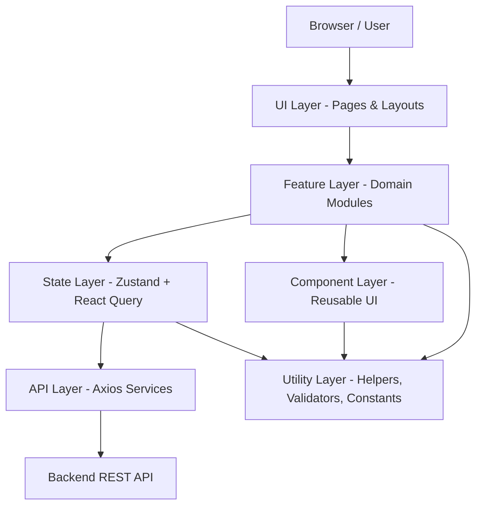
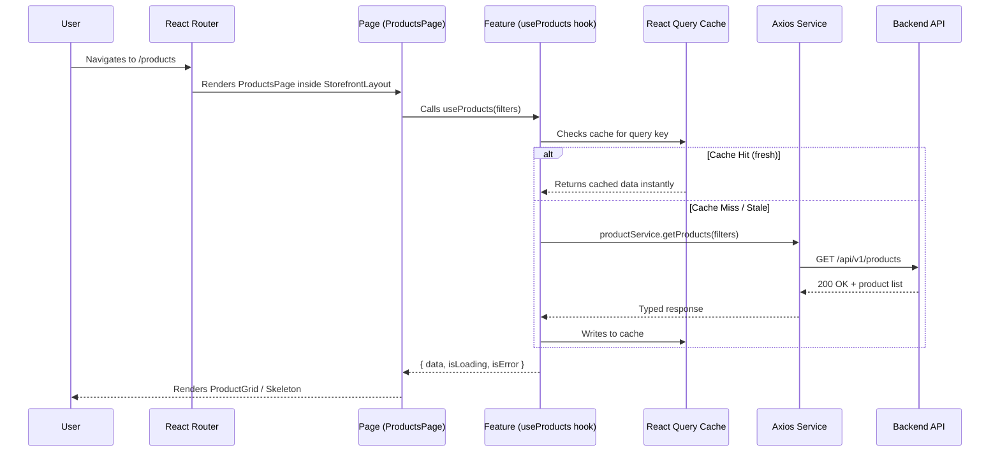
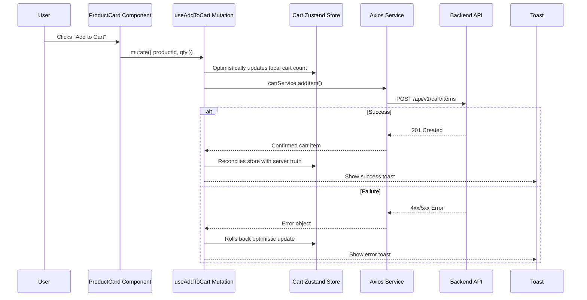
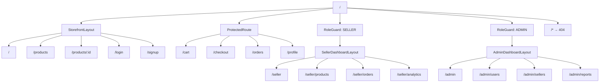
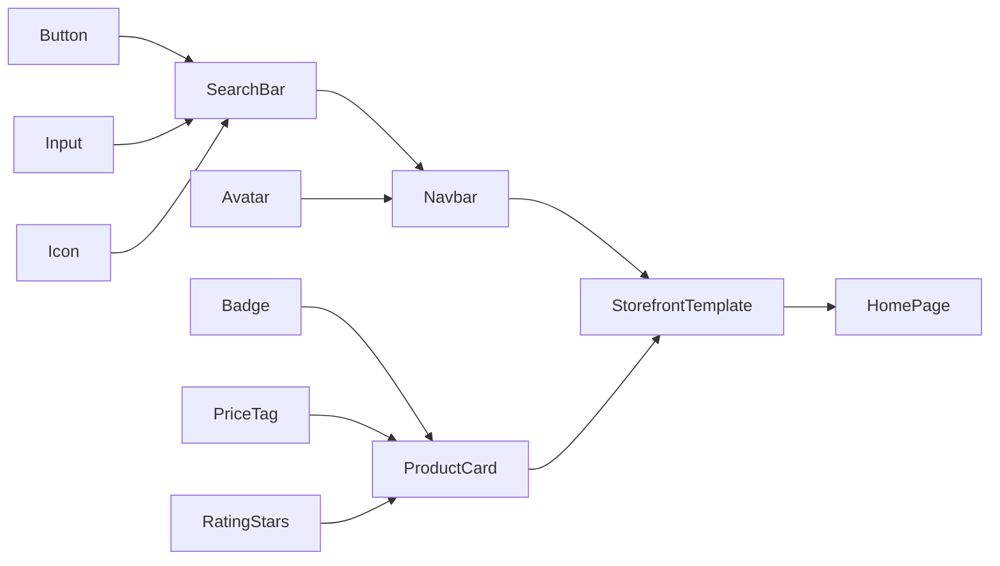
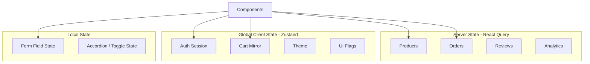
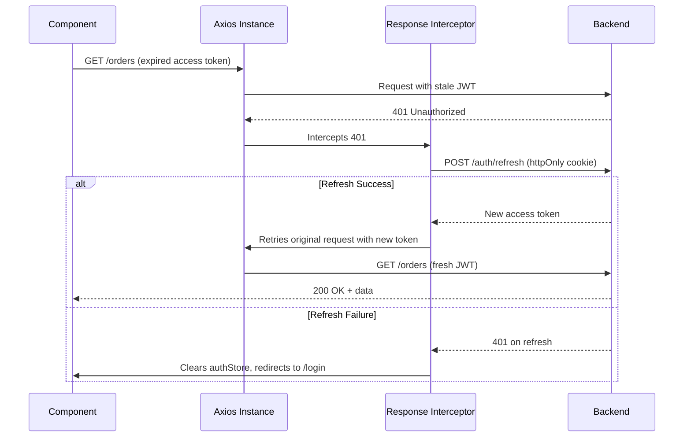
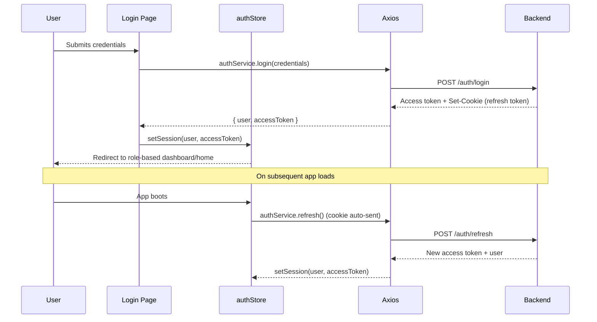
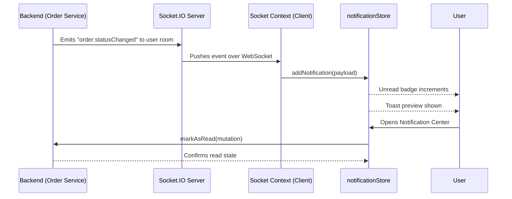
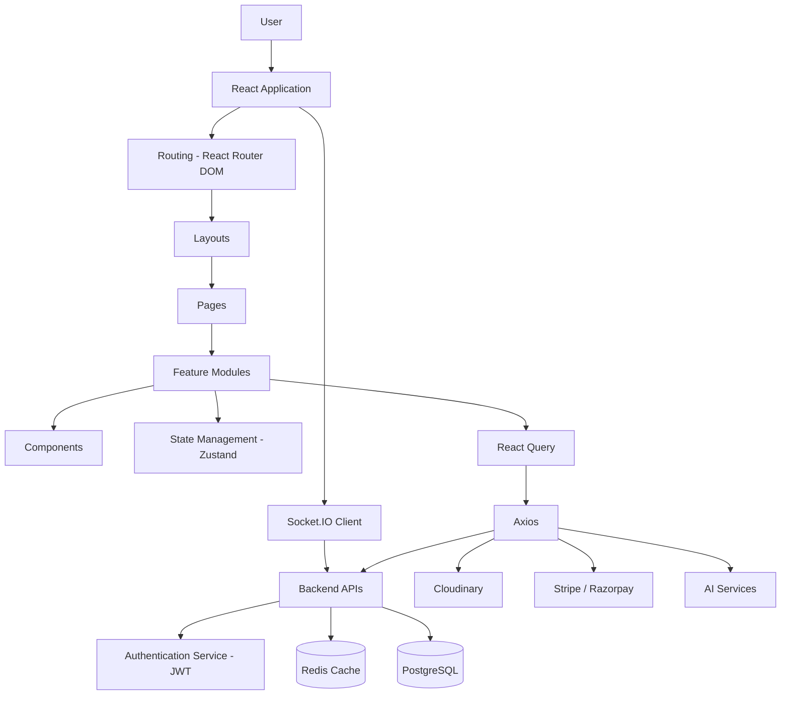

# Phase 7 — Frontend Architecture

**Project:** AI-Powered Smart Commerce Platform
**Document Type:** Enterprise Frontend Architecture Specification
**Stack:** React 19, TypeScript, Vite, Tailwind CSS, Shadcn/UI, React Router DOM, TanStack Query, Zustand, React Hook Form, Zod, Framer Motion, Axios, Socket.IO Client, Recharts, React Hot Toast, Cloudinary, Stripe/Razorpay SDK, Vercel

---

## 1. Frontend High-Level Architecture

The frontend of the Smart Commerce Platform is built as a **layered, feature-driven Single Page Application (SPA)** using React 19 and TypeScript, bundled with Vite. The architecture mirrors the backend's separation of concerns (Phase 5) so that both halves of the system evolve in a predictable, symmetrical way — a **Presentation Layer** consuming a **Domain-Oriented Feature Layer**, backed by a **State Layer** and an **API Layer**, all sitting on top of a shared **Utility Layer**.

The guiding principle is: **pages compose features, features compose components, components never know about the network.**

### 1.1 Layered Architecture Diagram



### 1.2 Layer Responsibilities

**UI Layer (Pages & Layouts)**
Owns routing-level composition. A page never fetches data directly — it delegates to feature modules and arranges layout. Layouts (`AuthLayout`, `DashboardLayout`, `StorefrontLayout`) provide persistent chrome: headers, sidebars, footers.

**Component Layer**
Pure, presentational, reusable UI building blocks — buttons, cards, modals, tables. Components receive data and callbacks via props; they hold no business logic and make no network calls.

**Feature Layer**
Domain-oriented vertical slices (`auth`, `products`, `cart`, `checkout`, `seller-dashboard`, `admin-dashboard`, `ai-assistant`). Each feature owns its own components, hooks, API calls, and Zustand slices where applicable. This is where business logic lives.

**State Layer**
Split between **server state** (TanStack Query — anything that originates from the backend) and **client state** (Zustand — anything that is purely UI/session state: theme, cart drawer open/closed, wizard step). This split is deliberate and non-negotiable across the codebase (see Section 6).

**API Layer**
A single Axios instance with interceptors, wrapped by per-domain service modules (`authService`, `productService`, `orderService`). React Query hooks call these services — components never call Axios directly.

**Utility Layer**
Cross-cutting, stateless helpers: formatters, validators (Zod schemas), constants, type definitions, and shared `lib/` code (e.g., `cn()` class merger, date utilities, currency formatters).

### 1.3 Why This Shape

This layering enforces a **one-way dependency rule**: Pages depend on Features, Features depend on Components + State + API, and nothing depends upward. This prevents circular imports, makes features independently testable, and allows a feature (e.g., `ai-assistant`) to be deleted or feature-flagged without touching unrelated code — directly supporting the Scalability Strategy in Section 23.

---

## 2. Project Folder Structure

```
smart-commerce-frontend/
├── public/
│   ├── favicon.ico
│   ├── robots.txt
│   └── manifest.json
├── src/
│   ├── components/
│   │   ├── ui/                  # Shadcn primitives (Button, Input, Dialog...)
│   │   ├── common/               # App-wide composites (Navbar, Footer, EmptyState)
│   │   └── skeletons/            # Loading skeletons per entity
│   ├── features/
│   │   ├── auth/
│   │   │   ├── components/
│   │   │   ├── hooks/
│   │   │   ├── api/
│   │   │   ├── store/
│   │   │   └── types.ts
│   │   ├── products/
│   │   ├── cart/
│   │   ├── wishlist/
│   │   ├── checkout/
│   │   ├── orders/
│   │   ├── seller-dashboard/
│   │   ├── admin-dashboard/
│   │   ├── reviews/
│   │   ├── notifications/
│   │   └── ai-assistant/
│   ├── pages/
│   │   ├── customer/
│   │   ├── seller/
│   │   ├── admin/
│   │   └── public/
│   ├── layouts/
│   │   ├── AuthLayout.tsx
│   │   ├── StorefrontLayout.tsx
│   │   ├── SellerDashboardLayout.tsx
│   │   └── AdminDashboardLayout.tsx
│   ├── hooks/                    # Global, cross-feature hooks
│   │   ├── useDebounce.ts
│   │   ├── useMediaQuery.ts
│   │   └── useIntersectionObserver.ts
│   ├── services/                 # Barrel of domain API services
│   ├── api/
│   │   ├── axiosInstance.ts
│   │   ├── interceptors.ts
│   │   └── endpoints.ts
│   ├── store/                    # Global Zustand stores
│   │   ├── authStore.ts
│   │   ├── cartStore.ts
│   │   ├── themeStore.ts
│   │   └── uiStore.ts
│   ├── contexts/                 # React Context (rare, cross-cutting only)
│   │   └── SocketContext.tsx
│   ├── utils/
│   │   ├── formatters.ts
│   │   ├── currency.ts
│   │   └── date.ts
│   ├── constants/
│   │   ├── routes.ts
│   │   ├── roles.ts
│   │   └── config.ts
│   ├── types/
│   │   ├── api.d.ts
│   │   ├── entities.d.ts
│   │   └── global.d.ts
│   ├── validators/               # Zod schemas
│   │   ├── authSchema.ts
│   │   ├── productSchema.ts
│   │   └── checkoutSchema.ts
│   ├── assets/
│   │   ├── images/
│   │   └── icons/
│   ├── styles/
│   │   ├── globals.css
│   │   └── tailwind.css
│   ├── routes/
│   │   ├── AppRouter.tsx
│   │   ├── ProtectedRoute.tsx
│   │   ├── RoleGuard.tsx
│   │   └── routeConfig.ts
│   ├── lib/
│   │   ├── cn.ts
│   │   ├── queryClient.ts
│   │   └── socket.ts
│   ├── providers/
│   │   ├── AppProviders.tsx
│   │   ├── QueryProvider.tsx
│   │   └── ThemeProvider.tsx
│   ├── App.tsx
│   └── main.tsx
├── .env.example
├── index.html
├── vite.config.ts
├── tailwind.config.ts
├── tsconfig.json
└── package.json
```

### 2.1 Folder-by-Folder Rationale

- **`components/ui/`** — Shadcn/UI primitives, generated and lightly customized. Never contains business logic; treated as a design-system layer that can be regenerated.
- **`components/common/`** — Composites built from `ui/` primitives used across multiple features (Navbar, Footer, Pagination, EmptyState, ConfirmDialog).
- **`components/skeletons/`** — Dedicated skeleton components per entity (ProductCardSkeleton, OrderRowSkeleton) used during React Query loading states.
- **`features/`** — The heart of the app. Each folder is a vertical slice with its own `components/`, `hooks/`, `api/`, and (optionally) `store/`. Nothing outside a feature imports its internals except through an `index.ts` barrel export.
- **`pages/`** — Route-level components grouped by audience (customer/seller/admin/public). Pages are thin — they assemble layout + feature components.
- **`layouts/`** — Persistent chrome per app section, rendered via nested routes (Section 4).
- **`hooks/`** — Only hooks that are genuinely cross-feature (debounce, media query, intersection observer, click-outside). Feature-specific hooks live inside `features/*/hooks`.
- **`services/` & `api/`** — `api/axiosInstance.ts` configures the single Axios client; `api/interceptors.ts` wires JWT injection and refresh logic; `services/` exposes typed functions per domain that feature hooks call.
- **`store/`** — Global Zustand stores that must be accessible app-wide: auth session, cart, theme, and generic UI state (modals, sidebar collapse).
- **`contexts/`** — Reserved for genuinely cross-cutting providers that don't fit Zustand's model, primarily the Socket.IO connection context.
- **`utils/`** — Pure functions: currency formatting, date formatting, string helpers. No React, no side effects.
- **`constants/`** — Route paths, role enums, app-wide config (API base URL, pagination sizes).
- **`types/`** — Shared TypeScript types/interfaces, especially API response shapes mirrored from the backend DTOs (Phase 5).
- **`validators/`** — Zod schemas, one file per domain, shared between forms and, where useful, query param parsing.
- **`assets/` & `styles/`** — Static assets and global Tailwind/CSS entry points.
- **`routes/`** — Centralized router configuration, route guards, and role-based access control components.
- **`lib/`** — Small framework-adjacent singletons: the `cn()` Tailwind class merger, the shared `queryClient`, and the Socket.IO client instance.
- **`providers/`** — Composition root for all context providers (Query, Theme, Auth bootstrap, Toaster) wrapped once in `main.tsx`.

---

## 3. Application Flow

The runtime data flow follows a consistent path from user interaction to UI re-render, regardless of feature.

### 3.1 Conceptual Flow

```
User Request
   ↓
React Router
   ↓
Layout
   ↓
Page
   ↓
Feature Module
   ↓
Components
   ↓
React Query
   ↓
Axios
   ↓
Backend API
   ↓
Response
   ↓
State Update
   ↓
UI Re-render
```

### 3.2 Sequence Diagram — Read Flow (e.g., Product Listing Page)



### 3.3 Sequence Diagram — Write Flow (e.g., Add to Cart)



This dual-path pattern — cache-first reads through React Query, optimistic-then-reconciled writes through mutations — is applied consistently across cart, wishlist, and notification-read-state features.

---

## 4. Routing Architecture

Routing is centralized in `routes/AppRouter.tsx` using **React Router DOM v6+** data APIs, with role-aware guards and full code-splitting.

### 4.1 Route Categories

- **Public Routes** — Home, Product Listing, Product Detail, Search, Login, Signup, Forgot Password. No auth required.
- **Protected Routes** — Cart, Checkout, Order History, Profile, Wishlist. Require a valid session; unauthenticated users are redirected to `/login` with a `redirectTo` query param.
- **Seller Routes** — `/seller/*` — require `role === SELLER`, nested under `SellerDashboardLayout`.
- **Admin Routes** — `/admin/*` — require `role === ADMIN`, nested under `AdminDashboardLayout`.
- **Nested Routes** — Dashboards use `<Outlet />`-based nesting so sidebars/headers persist while inner content swaps.
- **Dynamic Routes** — `/products/:productId`, `/orders/:orderId`, `/seller/products/:productId/edit`.
- **Error Routes** — `*` catches unmatched paths to a 404 page; a top-level `ErrorBoundary` route renders a 500-style fallback for render/query errors.

### 4.2 Lazy Loading & Code Splitting

Every page component is imported via `React.lazy()` and grouped by role so that a customer never downloads seller/admin bundles:

```tsx
const SellerDashboard = lazy(() => import("@/pages/seller/SellerDashboard"));
const AdminDashboard = lazy(() => import("@/pages/admin/AdminDashboard"));
```

Each top-level `<Route>` wraps its `element` in `<Suspense fallback={<PageSkeleton />}>`, and Vite's Rollup output automatically chunk-splits per dynamic import, aligning bundle boundaries with role boundaries (Section 12).

### 4.3 Route Guards

- **`ProtectedRoute`** — Reads `authStore`; if no valid session, redirects to `/login`.
- **`RoleGuard`** — Wraps `ProtectedRoute`; checks `user.role` against an allowed-roles list; redirects to a `403 Forbidden` page otherwise.

### 4.4 Route Tree Diagram



---

## 5. Component Architecture

Component design follows **Atomic Design**, adapted pragmatically for a React + Shadcn stack.

```
Atoms
   ↓
Molecules
   ↓
Organisms
   ↓
Templates
   ↓
Pages
```

- **Atoms** — Shadcn primitives: `Button`, `Input`, `Badge`, `Avatar`, `Checkbox`. Live in `components/ui/`.
- **Molecules** — Small combinations of atoms: `SearchBar` (Input + Icon + Button), `PriceTag`, `RatingStars`, `QuantitySelector`.
- **Organisms** — Self-contained, feature-aware sections: `ProductCard`, `CartDrawer`, `CheckoutSummary`, `OrderTable`. These live inside `features/*/components`.
- **Templates** — Layout skeletons that arrange organisms without real data: `DashboardTemplate`, `ProductGridTemplate`.
- **Pages** — Templates filled with live data via feature hooks; the final routed unit.

### 5.1 Component Diagram



### 5.2 Reusable Component Strategy

1. **Composition over configuration** — prefer children/slots (`<Card><Card.Header/><Card.Body/></Card>`) over giant prop lists.
2. **Controlled/uncontrolled duality** — interactive atoms accept optional `value`/`onChange` but default to internal state when omitted.
3. **Variant-driven styling** — use `class-variance-authority` (already bundled with Shadcn) for `variant`/`size` props instead of ad-hoc className branching.
4. **No feature imports in `components/`** — atoms/molecules/common organisms never import from `features/`, keeping the design-system layer portable.
5. **Co-located skeletons** — every data-driven organism has a matching skeleton in `components/skeletons/`, used identically wherever that organism appears.

---

## 6. State Management Architecture

State is deliberately partitioned by **origin and lifetime**, not by convenience.

| State Type | Owner | Examples |
|---|---|---|
| Server State | TanStack Query | products, orders, reviews, seller analytics |
| Global Client State | Zustand | auth session, cart, theme, notification unread count |
| Local Component State | `useState`/`useReducer` | form field focus, accordion open/close, hover state |
| Cross-cutting Non-Store State | Context API | active Socket.IO connection instance |

### 6.1 Server State — TanStack Query

All backend-originated data is fetched and cached through React Query. Query keys are namespaced and typed (`["products", filters]`, `["order", orderId]`), with sensible `staleTime`/`gcTime` per domain (e.g., product catalog: 5 min stale time; cart: near-zero, since it must reflect server truth quickly). Mutations use `onMutate`/`onError`/`onSettled` for optimistic updates with rollback, and `invalidateQueries` to keep related caches (e.g., cart badge count) in sync after checkout.

### 6.2 Global State — Zustand

- **`authStore`** — current user, access token (in memory only — see Section 20), `isAuthenticated`, role.
- **`cartStore`** — locally mirrored cart items and count for instant UI feedback, reconciled against server responses.
- **`themeStore`** — light/dark mode, persisted to `localStorage` via Zustand's `persist` middleware.
- **`uiStore`** — ephemeral UI flags: mobile sidebar open, active modal id, global loading overlay.

Each store is a small, focused slice — never one giant "app store" — so components subscribe only to what they need and avoid unnecessary re-renders.

### 6.3 Local State & Context API

Local `useState`/`useReducer` covers anything that doesn't need to survive a re-render of a parent or be shared. Context API is reserved for the Socket.IO connection object (Section 15) — a case where prop drilling would be worse than a narrowly-scoped provider, but where Zustand's store semantics don't fit (it's a live connection object, not serializable state).

### 6.4 State Ownership Diagram



---

## 7. API Communication Architecture

All HTTP traffic flows through a single configured Axios instance, never raw `fetch()`.

```
Axios Instance
   ↓
Request Interceptor
   ↓
JWT Injection
   ↓
Backend
   ↓
Response Interceptor
   ↓
Auto Refresh Token
   ↓
Retry Request
   ↓
Logout on Refresh Failure
```

### 7.1 Instance & Interceptors

`api/axiosInstance.ts` sets `baseURL` from environment config and default headers. `api/interceptors.ts` attaches:

- **Request interceptor** — reads the in-memory access token from `authStore` and sets `Authorization: Bearer <token>`.
- **Response interceptor** — on a `401`, pauses the failing request, calls the refresh-token endpoint (using the httpOnly refresh cookie set by the backend in Phase 5), and on success retries the original request with the new access token. Concurrent 401s are queued so only one refresh call fires at a time. On refresh failure, the interceptor clears `authStore` and redirects to `/login`.

### 7.2 Sequence Diagram — Token Refresh Flow



### 7.3 Service Layer Pattern

Feature hooks never call `axiosInstance` directly. Instead, each domain exposes a typed service module, e.g.:

```ts
// features/products/api/productService.ts
export const productService = {
  getAll: (filters: ProductFilters) =>
    axiosInstance.get<ProductListResponse>("/products", { params: filters }),
  getById: (id: string) =>
    axiosInstance.get<Product>(`/products/${id}`),
};
```

React Query hooks (`useProducts`, `useProduct`) wrap these services, keeping network concerns entirely out of components.

---

## 8. Authentication Architecture

### 8.1 Flow Overview

Signup and Login post credentials to the backend (Phase 5's JWT + refresh-token system). On success, the backend returns a short-lived **access token** (kept in memory, in `authStore`) and sets a long-lived **refresh token** as an httpOnly cookie. The frontend never persists the access token to `localStorage`.

### 8.2 Session Restore & Auto Login

On app boot, `AppProviders` silently calls `/auth/refresh` (relying on the httpOnly cookie) to restore a session without requiring the user to log in again, populating `authStore` before the router renders protected content. A "Remember Me" checkbox on login extends refresh-token cookie expiry server-side; it does not change frontend token storage behavior.

### 8.3 Role Detection & Protected Pages

The decoded user object (returned alongside the access token) carries `role: CUSTOMER | SELLER | ADMIN`. `RoleGuard` (Section 4.3) reads this from `authStore` to gate seller/admin routes, and UI elements (e.g., "Become a Seller" CTA vs. "Seller Dashboard" link) conditionally render based on the same field.

### 8.4 Logout

Logout calls `/auth/logout` (invalidating the refresh cookie server-side), clears `authStore`, clears React Query's cache (`queryClient.clear()`), and redirects to `/login`.

### 8.5 Authentication Sequence Diagram



---

## 9. UI Design System

The design system is implemented via Tailwind CSS design tokens and Shadcn/UI component primitives, ensuring visual consistency across customer, seller, and admin surfaces.

- **Typography** — a constrained type scale (`text-xs` → `text-4xl`) with a single primary font family for body text and a distinct weight-heavy family for headings/branding, defined once in `tailwind.config.ts`.
- **Color Palette** — semantic tokens (`--primary`, `--secondary`, `--destructive`, `--muted`, `--success`, `--warning`) rather than raw hex usage in components, enabling theme swaps without touching component code.
- **Spacing System** — Tailwind's 4px-based spacing scale used exclusively; no arbitrary pixel values in component classNames.
- **Border Radius** — a small token set (`--radius-sm/md/lg/full`) applied consistently so cards, buttons, and inputs share a visual language.
- **Elevation** — a limited shadow scale (`shadow-sm/md/lg`) reserved for modals, dropdowns, and floating cart drawers only, to avoid visual noise.
- **Animations** — Framer Motion variants layered on top of Tailwind transitions (Section 13).
- **Dark Mode** — implemented via a `class`-based Tailwind strategy, toggled through `themeStore`, persisted to `localStorage`.
- **Responsive Breakpoints** — Tailwind defaults (`sm/md/lg/xl/2xl`) mapped explicitly to the platform's target devices (Section 18).
- **Accessibility Standards** — WCAG 2.1 AA target baked into token choices (contrast-checked palette) and component defaults (Section 19).
- **Component Variants** — `cva`-driven variants (`default/outline/ghost/destructive` for buttons; `default/success/warning/destructive` for badges).
- **Design Tokens** — centralized in `tailwind.config.ts` and CSS custom properties in `styles/globals.css`, the single source of truth consumed by both Shadcn components and custom organisms.

---

## 10. Form Architecture

All forms use **React Hook Form** for state/performance and **Zod** for schema validation, connected via `@hookform/resolvers/zod`.

### 10.1 Pattern

```ts
// validators/checkoutSchema.ts
export const checkoutSchema = z.object({
  fullName: z.string().min(2),
  address: z.string().min(5),
  city: z.string().min(2),
  postalCode: z.string().regex(/^\d{5,6}$/),
  paymentMethod: z.enum(["CARD", "UPI", "COD"]),
});
export type CheckoutFormValues = z.infer<typeof checkoutSchema>;
```

```tsx
const form = useForm<CheckoutFormValues>({
  resolver: zodResolver(checkoutSchema),
  defaultValues,
});
```

### 10.2 Form Categories

- **Reusable Form Components** — `FormField`, `FormError`, `FormSelect` wrap Shadcn inputs with React Hook Form's `Controller`, standardizing error display and label association across the app.
- **Dynamic Forms** — seller product creation supports dynamic variant rows (`useFieldArray`) for size/color/price combinations.
- **Multi-Step Forms** — checkout (Address → Payment → Review) is modeled as a single Zod schema split into per-step field subsets, with a local `currentStep` state driving which subset is validated via `trigger()`.
- **File Upload Forms** — product image upload integrates Cloudinary's client-side widget/upload API, storing returned secure URLs as form field values validated by a `z.string().url()` schema.
- **Error Handling** — field-level errors render inline via `formState.errors`; submit-level (server) errors surface as a toast plus an inline `FormError` banner, keeping both channels available without duplicating messaging.

---

## 11. Search Architecture

- **Debounced Search** — the storefront search bar uses `useDebounce` (300ms) before firing a query, preventing request spam on every keystroke.
- **Autocomplete** — a lightweight suggestions endpoint is queried on debounce, rendered in a floating listbox with keyboard navigation (arrow keys + enter), satisfying accessibility requirements (Section 19).
- **Recent Searches** — stored client-side (Zustand `persist`, capped at 10 entries) and shown when the search input is focused but empty.
- **Filters & Sorting** — category, price range, rating, and seller filters are serialized into URL search params (via React Router's `useSearchParams`), making filtered views shareable/bookmarkable and keeping React Query's cache key naturally scoped to the URL state.
- **Pagination & Infinite Scroll** — the catalog defaults to page-based pagination (`useQuery` keyed by page) for SEO-friendly indexable pages; category/browse feeds use `useInfiniteQuery` with an `IntersectionObserver` sentinel for a continuous-scroll experience.
- **Semantic Search** — free-text queries are routed to the AI-assistant's semantic search endpoint (Phase 5's embedding-backed search) when the "Smart Search" toggle is active, falling back to keyword search otherwise.
- **Voice Search (Future)** — planned integration via the Web Speech API, transcribing to the same debounced text input, requiring no changes to the query pipeline.
- **Image Search (Future)** — planned Cloudinary-based reverse image lookup feeding the same semantic search endpoint with an image embedding instead of text.

---

## 12. Frontend Performance Architecture

- **Lazy Loading / `React.lazy` / Suspense** — every route-level page and heavy, rarely-used components (e.g., chart-heavy analytics panels, the AI chat widget) are lazy-loaded (Section 4.2).
- **Memoization** — `React.memo` on pure list-item components (`ProductCard`, `OrderRow`); `useMemo`/`useCallback` reserved for genuinely expensive derivations or stable references passed to memoized children — not applied reflexively.
- **Code Splitting** — role-based route splitting (customer/seller/admin bundles) plus vendor chunk splitting configured in `vite.config.ts`.
- **Image Optimization** — all product/user images served through Cloudinary's on-the-fly transformation URLs (responsive `srcset`, WebP/AVIF auto-format, lazy `loading="lazy"` attributes).
- **Virtualization** — long lists (admin user tables, seller order history) use windowed rendering to keep DOM node counts bounded regardless of dataset size.
- **Prefetching** — React Query's `prefetchQuery` is triggered on product-card hover for the product detail route, and React Router's `<Link prefetch>`-equivalent pattern preloads the next likely route chunk.
- **Caching** — React Query's stale-while-revalidate model (Section 6.1) is the primary caching layer; static assets are cached via Vercel's CDN (Section 22).
- **Bundle Optimization & Tree Shaking** — ES modules throughout, Shadcn components imported individually (not as a barrel), and `vite-bundle-visualizer` run periodically to catch bundle regressions.

---

## 13. Animation Architecture

Framer Motion is used purposefully, not decoratively, with a small shared set of variants defined once in `lib/motionVariants.ts` and reused across features.

- **Page Transitions** — subtle fade/slide on route change, wrapped via `AnimatePresence` in `AppRouter`.
- **Modal Animations** — scale + fade entrance/exit for dialogs, consistent across confirm dialogs, product quick-view, and cart drawer.
- **Loading Skeletons** — shimmer animation via a shared `Skeleton` primitive (CSS-based, not Framer, to avoid animation cost during heavy loading states).
- **Hover Effects** — `whileHover`/`whileTap` on product cards and buttons for tactile feedback.
- **Micro Interactions** — cart icon "pulse" on item add, toast slide-in, wishlist heart fill animation.
- **Scroll Animations** — `whileInView` reveal animations for marketing/landing sections only — never on data-dense dashboard views, to keep those snappy.
- **Gesture Support** — swipe-to-dismiss on mobile cart drawer and notification items via Framer's drag gesture API.

---

## 14. Error Handling Architecture

- **API Errors** — the Axios response interceptor normalizes backend error shapes into a consistent `{ message, code, status }` object consumed uniformly by React Query's `onError` handlers.
- **Network Errors** — detected via Axios's `error.request` with no `response`; surfaced as a distinct "You appear to be offline" toast rather than a generic error message.
- **Validation Errors** — handled entirely client-side by Zod before submission; server-side validation errors (422) are mapped back onto the corresponding React Hook Form fields via `setError`.
- **404 / 500** — dedicated route-level pages (`NotFoundPage`, `ServerErrorPage`) rendered by the catch-all route and by a top-level React `ErrorBoundary` respectively.
- **Error Boundaries** — a global boundary wraps `AppRouter`; feature-level boundaries wrap high-risk widgets (AI assistant, analytics charts) so a failure there doesn't blank the whole dashboard.
- **Toast Notifications** — React Hot Toast is the single channel for transient error/success feedback, with a shared `notify.error()`/`notify.success()` wrapper enforcing consistent styling and duration.
- **Retry Strategy** — React Query's default exponential-backoff retry (capped at 2 retries) for idempotent GETs; mutations never auto-retry to avoid duplicate writes (e.g., double order placement).
- **Offline Mode** — a lightweight `navigator.onLine` listener sets a global `uiStore` flag that disables write actions (checkout, add-to-cart) and shows a persistent banner until connectivity returns.

---

## 15. Notification Architecture

- **Toast** — immediate, ephemeral feedback (React Hot Toast) for the current user's own actions.
- **Real-time Notifications** — a Socket.IO client connection (established post-login, via `SocketContext`) subscribes to the authenticated user's private room, pushing order-status updates, price-drop alerts, and seller-order notifications live.
- **Browser Notifications** — opt-in native `Notification` API integration for high-priority events (order shipped, payment confirmed) when the tab is backgrounded.
- **Unread Count** — maintained in a Zustand slice (`notificationStore`), incremented on incoming socket events and reset on notification-center open, with the count also mirrored via React Query when the center is opened (server as source of truth).
- **Notification Center** — a dropdown/panel listing paginated notifications (`useInfiniteQuery`), with read/unread state synced optimistically then confirmed via a mark-as-read mutation.

### 15.1 Real-Time Notification Sequence



---

## 16. Dashboard Architecture

- **Customer Dashboard** — order history, wishlist, saved addresses, profile settings; a simpler, single-sidebar layout under `StorefrontLayout`.
- **Seller Dashboard** — product management, order fulfillment queue, revenue analytics, review management; under `SellerDashboardLayout` with a persistent collapsible sidebar.
- **Admin Dashboard** — user/seller management, platform-wide analytics, moderation queues, system health; under `AdminDashboardLayout` with role-specific navigation sections.
- **Role Switching** — for users who are both customers and (approved) sellers, a role-switcher in the navbar toggles the active dashboard context without a full re-login, updating `authStore.activeRole` and re-routing.
- **Sidebar & Navigation** — each dashboard layout defines its nav items as a typed config array (`{ label, icon, path, roles }`), filtered at render time so navigation is declarative and easy to extend.
- **Analytics Widgets, Charts, Cards, Tables** — Recharts powers all dashboard visualizations (revenue line charts, order-status pie charts, top-products bar charts), paired with reusable `StatCard` (KPI summary) and `DataTable` (sortable, paginated) organisms shared between seller and admin dashboards.

---

## 17. AI Features Architecture

- **AI Assistant UI** — a persistent floating chat widget (lazy-loaded), streaming responses over the backend's AI endpoint, rendered feature-locally in `features/ai-assistant/`.
- **Recommendation Widgets** — "You might also like" and "Frequently bought together" organisms fetched via a dedicated recommendations query, placed on product detail and cart pages.
- **AI Search** — the "Smart Search" toggle described in Section 11, routing queries to semantic/embedding-based search.
- **Product Comparison** — a comparison tray (Zustand slice holding up to 4 product IDs) rendering a side-by-side spec table, with an optional AI-generated comparison summary.
- **Review Summarization** — product detail pages show an AI-generated summary of aggregated reviews above the raw review list, fetched lazily on scroll-into-view.
- **Smart Suggestions** — checkout and cart pages surface AI-driven upsell/cross-sell suggestions as a non-blocking carousel.
- **Chat Interface** — the assistant widget supports streamed token rendering (via a `ReadableStream`/SSE consumer hook), optimistic message echo, and graceful fallback to a "typing failed, retry" state on stream error.

---

## 18. Responsive Architecture

- **Mobile First** — all Tailwind utility usage is written mobile-first, with `md:`/`lg:` overrides layered on top, ensuring the smallest viewport is never an afterthought.
- **Tablet** — dashboard sidebars collapse to an icon-only rail at `md` breakpoint, expanding on demand.
- **Desktop** — full multi-column layouts (product grid, dashboard with persistent sidebar) activate at `lg`.
- **Large Screens** — a `max-w-screen-2xl` content constraint prevents excessive line-length/whitespace sprawl on ultra-wide monitors.
- **Grid System** — Tailwind's CSS Grid utilities drive the product catalog (`grid-cols-2 sm:grid-cols-3 lg:grid-cols-4`) and dashboard widget layouts.
- **Breakpoints** — standard Tailwind scale (`sm:640px`, `md:768px`, `lg:1024px`, `xl:1280px`, `2xl:1536px`) used consistently; no custom breakpoints introduced without a documented reason.
- **Adaptive Layouts** — the cart, on mobile, renders as a full-screen sheet; on desktop, as a slide-in drawer — same `CartDrawer` component, different Shadcn `Sheet` side prop driven by a `useMediaQuery` hook.

---

## 19. Accessibility Architecture

- **WCAG Standards** — WCAG 2.1 Level AA is the platform baseline, validated via `axe-core` in CI (Section 21) and manual audits before major releases.
- **Keyboard Navigation** — all interactive elements are reachable and operable via keyboard alone; custom components (autocomplete listbox, product comparison tray) implement full arrow-key/enter/escape handling rather than relying on default `div` behavior.
- **ARIA Labels** — icon-only buttons (wishlist heart, cart icon) always carry `aria-label`; live regions (`aria-live="polite"`) announce cart updates and toast messages to screen readers.
- **Focus Management** — modals/drawers trap focus on open (Shadcn's Radix-based primitives provide this out of the box) and restore focus to the triggering element on close.
- **Color Contrast** — the design-token palette (Section 9) is contrast-checked against WCAG AA thresholds for both light and dark themes.
- **Screen Readers** — tested against NVDA/VoiceOver for critical flows (checkout, search, notification center).
- **Semantic HTML** — `nav`, `main`, `header`, `footer`, `button` vs `a` usage is enforced via ESLint's `jsx-a11y` plugin, not left to convention alone.

---

## 20. Frontend Security

- **XSS Prevention** — no `dangerouslySetInnerHTML` outside a single, tightly-scoped rich-text renderer for seller product descriptions, which passes content through a sanitization library (DOMPurify) before render.
- **Token Handling** — the JWT access token lives only in memory (`authStore`), never in `localStorage`/`sessionStorage`, eliminating XSS-based token theft as an attack vector; the refresh token is an httpOnly, `SameSite=Strict` cookie inaccessible to JavaScript entirely.
- **Secure Storage** — the only client-persisted data (`localStorage` via Zustand `persist`) is non-sensitive: theme preference and recent search terms.
- **Input Sanitization** — all user-generated text (reviews, seller descriptions) is sanitized both client-side (DOMPurify on render) and server-side (Phase 5), defense-in-depth.
- **CSRF Considerations** — the httpOnly refresh cookie is `SameSite=Strict`, and state-changing requests require the in-memory-held JWT bearer token (not cookie-authenticated), which structurally mitigates classic CSRF against the API.
- **Environment Variables** — all client-exposed config uses Vite's `VITE_` prefix convention and contains no secrets (API base URL, Stripe/Razorpay publishable keys only); true secrets never leave the backend.
- **Content Security Policy** — a CSP header (configured at the Vercel edge, Section 22) restricts script/style/img sources to self, Cloudinary, and the payment SDK domains, mitigating injected third-party script risk.

---

## 21. Testing Strategy

| Layer | Tool | Scope |
|---|---|---|
| Unit Testing | Vitest | Utilities, validators, Zustand store logic |
| Component Testing | React Testing Library + Vitest | Individual components/hooks in isolation |
| Integration Testing | React Testing Library + MSW | Feature flows (e.g., add-to-cart end-to-end within the app tree) |
| E2E Testing | Playwright | Full user journeys across real routes (signup → browse → checkout) |

- **Vitest** — the primary test runner, sharing Vite's config/aliases for fast, consistent test execution.
- **React Testing Library** — tests components by user-visible behavior (queries by role/label) rather than implementation detail, aligning with accessibility goals in Section 19.
- **Mock Service Worker (MSW)** — intercepts network calls at the service-worker level for integration tests, so components exercise real Axios/React Query code paths against realistic mocked responses instead of mocked hooks.
- **Playwright** — drives critical-path E2E suites (auth, checkout, seller product creation) against a deployed preview environment (Section 22) in CI, catching regressions across real browsers.
- Coverage targets are enforced per layer (higher for `utils`/`validators`, pragmatic for UI-heavy organisms), reviewed as part of the Code Review Standards in Section 24.

---

## 22. Deployment Architecture

- **Vercel Deployment** — the frontend deploys as a static Vite build to Vercel, with the framework preset auto-detecting build/output settings (`npm run build` → `dist/`).
- **Environment Variables** — `VITE_API_BASE_URL`, `VITE_STRIPE_PUBLISHABLE_KEY`/`VITE_RAZORPAY_KEY_ID`, `VITE_CLOUDINARY_CLOUD_NAME`, and `VITE_SOCKET_URL` are configured per Vercel environment (Development/Preview/Production), mirroring the backend's environment matrix from Phase 6.
- **Preview Deployments** — every pull request gets an automatic Vercel preview URL, wired to the staging backend, enabling Playwright E2E runs and manual QA before merge.
- **Production Deployment** — merges to `main` trigger a production build/deploy, gated behind the CI pipeline (lint, type-check, unit/integration tests) defined in Phase 6's GitHub Actions setup.
- **CDN** — all static assets (JS/CSS bundles, fonts) are served from Vercel's global edge CDN; Cloudinary separately CDN-serves all images.
- **Caching** — immutable, content-hashed asset filenames (Vite's default) allow aggressive `Cache-Control: immutable` headers; `index.html` itself is served with no-cache to guarantee clients always pick up the latest asset manifest.
- **Performance Monitoring** — Vercel Analytics/Speed Insights tracks Core Web Vitals in production, feeding back into the performance work described in Section 12.

---

## 23. Scalability Strategy

- **Feature-based Architecture** — the `features/` vertical-slice structure (Section 2) is the primary scalability lever: new domains (e.g., `subscriptions`, `loyalty-points`) are added as new folders without touching existing ones.
- **Reusable Components** — the `components/ui/` + `components/common/` design-system layer is deliberately framework-agnostic in intent, minimizing the cost of a future UI refresh.
- **Shared Libraries** — cross-cutting logic (`lib/`, `utils/`, `validators/`) is kept dependency-light so it could, if needed, be extracted into an internal npm package for a future second frontend (e.g., a seller-only native app).
- **Design System** — token-driven styling (Section 9) means a full visual rebrand touches `tailwind.config.ts`/`globals.css`, not hundreds of components.
- **Micro Frontend Migration Strategy** — should the platform later need independently deployable surfaces (e.g., the admin dashboard shipped by a separate team on its own release cadence), the existing role-based route/bundle split (Section 4.2, Section 12) is already the natural seam: `seller/*` and `admin/*` could be extracted into separate Vite apps behind Module Federation or served as separate Vercel projects under path-based routing, with `store/authStore` and design tokens published as shared packages to keep sessions and styling consistent across the split.

---

## 24. Frontend Best Practices

- **SOLID Principles (adapted for React)** — components have a single reason to change (Single Responsibility); feature modules depend on abstractions (service interfaces) not concrete Axios calls directly inside components (Dependency Inversion).
- **Clean Code** — small, named functions over inline anonymous logic in JSX; early returns over deep conditional nesting; no commented-out dead code committed.
- **Folder Naming** — all-lowercase, kebab-case for folders (`ai-assistant`, `seller-dashboard`); one feature = one folder.
- **Component Naming** — PascalCase for components, matching filename (`ProductCard.tsx` exports `ProductCard`); hooks prefixed `use` and camelCase (`useProducts.ts`).
- **Hooks Rules** — enforced via `eslint-plugin-react-hooks`; no conditional hook calls; custom hooks composed from primitive hooks, never wrapping side effects invisibly.
- **Performance Rules** — memoization applied only after a measured re-render problem, not preemptively (Section 12); list rendering always keyed by stable IDs, never array index.
- **Accessibility Rules** — `jsx-a11y` ESLint rules are build-blocking, not warnings, for the core interactive component set.
- **Code Review Standards** — every PR requires: passing CI (lint, type-check, tests), a screenshot/GIF for UI changes, and explicit callout of any new dependency added to `package.json`.

---

## 25. Complete Frontend Architecture Diagram



---

## Frontend Architecture Summary

The Smart Commerce Platform's frontend is a **feature-first, strictly layered React 19 + TypeScript application** where every architectural decision reinforces the same core rule: **server state, client state, and presentation never blur into one another.** TanStack Query owns everything that comes from the backend; Zustand owns everything that is purely client-side session/UI state; components remain presentational and network-agnostic; and a single Axios instance with interceptor-driven JWT refresh is the only path to the backend.

Routing is role-aware and code-split from the ground up (public/customer/seller/admin), so bundle size scales with what a given user actually needs, not with the platform's total feature surface. Atomic Design keeps the component layer composable and testable, Shadcn/UI and Tailwind's token system keep the visual language consistent and reskin-able, and Framer Motion is scoped to genuinely meaningful interactions rather than blanket decoration.

Real-time behavior (notifications, order-status updates) rides a dedicated Socket.IO context layered cleanly alongside — not inside — the React Query cache, and AI-driven features (semantic search, recommendations, the assistant chat widget, review summarization) are implemented as ordinary feature modules, meaning they inherit the same lazy-loading, error-boundary, and state-management guarantees as every other part of the app rather than requiring special-case handling.

Security is handled by structural choice rather than after-the-fact hardening: in-memory-only access tokens, httpOnly refresh cookies, sanitized rich text, and a locked-down CSP. Testing spans Vitest unit/component tests, MSW-backed integration tests, and Playwright E2E suites running against real Vercel preview deployments, feeding a CI pipeline that gates every production deploy.

Together with Phase 5 (Backend Architecture) and Phase 6 (DevOps & Infrastructure), this Phase 7 specification completes a symmetrical, production-ready blueprint: a frontend that scales feature-by-feature, degrades gracefully under error and offline conditions, performs well on constrained devices, and remains straightforward for a growing engineering team to extend without architectural erosion.